# UE5网络

# 网络构架

### **Server-Client构架**

一个服务器和多个客户端，所有重要信息都需要通过服务器验证（假设所有玩家都作弊，客户端不可信任），服务器有Listen Server和Dedicated Server。

- Listen Server本身也是个玩家，诸如暗黑破坏神、CSGO等早期游戏由主玩家建立房间监听等待其他玩家加入；（服务器是玩家自己有很多优势）
- 专有服务器自己不是玩家，只计算其他客户端数据。（公平对待每个客户端）

作为客户端，操作的角色有两个，本地角色和服务端与之生成远程代理（远程角色），本地角色负责模拟行动，远程角色负责计算结果。

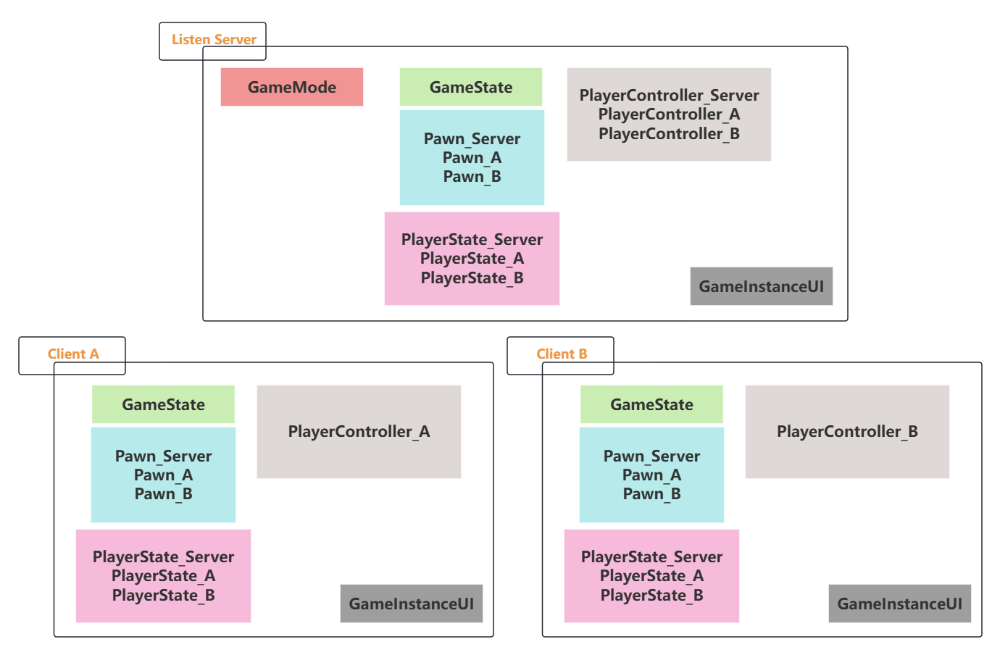

网络信息传递的主要方式：网络复制（Replication与Rep_Notify）、RPC。

网络复制是单向的，只能从服务端到客户端，RPC则更为多样。

# 网络复制Replication

服务端同步信息到各客户端。Replication相关代码写在Actor及其派生类里了（往上比如UObject就没有网络复制功能了）。

### **Actor Replication**

服务端生成，客户端也跟着生成。开启网络复制功能才能进行属性复制、组件复制、RPC总开关。

c++：bRpelicates=true;在构造函数里写

```cpp
//Head
#pragma once
#include "CoreMinimal.h"
#include "GameFramework/Actor.h"
#include "MyCubeActor.generated.h"

UCLASS()
class MYFPS_API AMyCubeActor : public AActor
{
	GENERATED_BODY()

public:	
	AMyCubeActor();
protected:
	virtual void BeginPlay() override;
public:	
	virtual void Tick(float DeltaTime) override;
};

//CPP
#include "MyCubeActor.h"

// Sets default values
AMyCubeActor::AMyCubeActor()
{
	PrimaryActorTick.bCanEverTick = true;
	bReplicates = true;
}

// Called when the game starts or when spawned
void AMyCubeActor::BeginPlay()
{
	Super::BeginPlay();
}
// Called every frame
void AMyCubeActor::Tick(float DeltaTime)
{
	Super::Tick(DeltaTime);
}
```

当我们在关卡中生成Actor时，需要校验权限，Has Authority-Authority服务端。

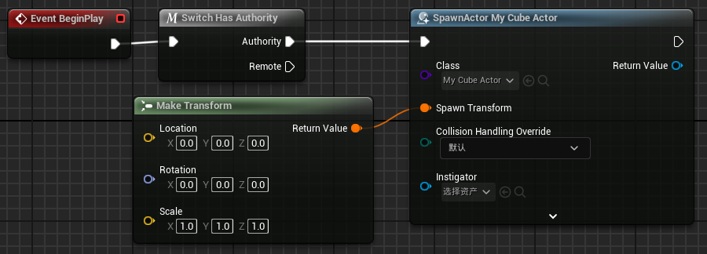

### **Property Replication**

c++的属性复制：

- 首先`#include "Net/UnrealNetwork.h"`
- 使用Replicated声明`UPROPERTY(Replicated)float point = 5.0f;`
- 添加函数`void GetLifetimeReplicatedProps(TArray<FLifetimeProperty>& OutLifetimeProps )const;`
    
    ```cpp
    void AMyCubeActor::GetLifetimeReplicatedProps(TArray<FLifetimeProperty>& OutLifetimeProps)const
    { 
    	Super::GetLifetimeReplicatedProps(OutLifetimeProps);
    	DOREPLIFETIME(AMyCubeActor,point);
    }
    ```
    

`GetLifetimeReplicatedProps` 是 Unreal Engine 提供的一个虚函数，用于告诉引擎哪些变量需要在网络中同步。
`DOREPLIFETIME` 是一个宏，用于注册一个变量，使其能够通过网络进行同步。

其中，可以使用`DOREPLIFETIME_CONDITION(ClassName, para, Conditon)`来定义不同的复制情

# 网络复制Rep_Notify

复制通知，如果一个变量设置为Rep_Notify，当该变量发生复制时，服务端和收到该值的客户端都可以调用一个自定义的函数。

注意：这是针对变量的。

蓝图：设置复制条件为复制通知。

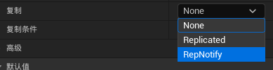

蓝图会自动生成OnRep_xxxx这样一个函数，在这个函数里进行逻辑编写（是一个回调函数）。

<aside>
💡

比如我设计了一个GameState保存所有玩家的分数，当玩家分数发生变化时，服务端就会将GameState里发生变化的分数同步到所有客户端，客户端收到信息后就可以调用自己的回调函数以执行相应的相应逻辑，比如更新自己的UI面板以显示正确的得分。

</aside>

c++：bReplicates=true

UPROPERTY(ReplicatedUsing=OnRep_xxx)

**C++里写复制通知，服务端自己并不会执行该回调函数，只有客户端执行。*

样例：创建一个具有Armor属性的Actor，实现每秒护甲衰减。

```cpp
//TestActor
#pragma once
#include "CoreMinimal.h"
#include "GameFramework/Actor.h"
#include "MyRepTestActor.generated.h"
//………………
//属性设置
	void GetLifetimeReplicatedProps(TArray<FLifetimeProperty>& OutLifetimeProps) const;
	UPROPERTY(EditAnywhere, BlueprintReadWrite, ReplicatedUsing=OnRep_Armor)
	float Armor = 100.0f;
	UFUNCTION()
	//客户端收到衰减值，同步更新并执行回调逻辑
	void OnRep_Armor();

//计时器句柄
	FTimerHandle TimerHandle;
	UFUNCTION()
	//每秒执行护甲衰减函数
	void StartArmorDecay();
	UFUNCTION()
	//护甲衰减具体逻辑
	void OnArmorDecay();
	
	//CPP
	void AMyRepTestActor::BeginPlay()
{
	Super::BeginPlay();
	if (HasAuthority())
	{//仅服务端调用
		StartArmorDecay();
	}
}
	void AMyRepTestActor::GetLifetimeReplicatedProps(TArray<FLifetimeProperty>& OutLifetimeProps) const
{
//注册护甲值
	Super::GetLifetimeReplicatedProps(OutLifetimeProps);
	DOREPLIFETIME(AMyRepTestActor, Armor);
}
//回调逻辑：打印当前护甲值
void AMyRepTestActor::OnRep_Armor()
{
	UE_LOG(LogTemp, Warning, TEXT("Client Armor:%f"), Armor);
}
//每秒衰减
void AMyRepTestActor::StartArmorDecay()
{
	
	GetWorld()->GetTimerManager().SetTimer(TimerHandle, this, &AMyRepTestActor::OnArmorDecay, 1.0f, true);
}
//衰减逻辑
void AMyRepTestActor::OnArmorDecay()
{
	Armor -= 1.0f;
	if (HasAuthority())
	{
		UE_LOG(LogTemp, Warning, TEXT("Server Armor:%f"), Armor);
	}
	if (Armor <= 0.0f)
	{
		Armor = 0.0f; // 防止继续减到负值
		//清除计数器
		if (GetWorld()->GetTimerManager().IsTimerActive(TimerHandle))
		{
			GetWorld()->GetTimerManager().ClearTimer(TimerHandle);
		}
	}
}
```

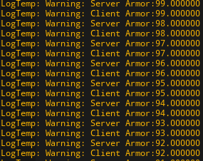

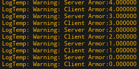

### **Component Replication**

# 所有权OwnerShip

对于每个接入服务器的Connection，其控制的对象是层级排布，自底向上追溯的，PlayerController可能控制着很多的Pawn。NPC没有所有权，不属于GamePlay的环境对象没有所有权。

OnwerShip的重要性：

- RPC需要确定哪个客户端将执行运行于客户端的RPC程序；
- Actor复制与连接相关性；
- 在涉及所有者时的Actor属性复制条件（条件复制）；
- 防作弊，客户端信息不互通。

条件复制：因为UE中当属性被注册到网络中去后，为了预计算和性能提升，将无法取消注册。因此当需要对属性复制过程进行更精细的控制后，就需要用到条件属性。用来控制的宏是：

<aside>
💡

**DOREPLIFETIME_CONDITION**(AActor，ReplicatedMovement,COND_SimulatedOnly)

</aside>

其他指令：

### **条件类型 (`COND_`)**

| **条件** | **描述** |
| --- | --- |
| `COND_None` | 总是同步该属性（默认行为）。 |
| `COND_InitialOnly` | 属性只在初次同步时被复制，之后的变化不会被同步。 |
| `COND_OwnerOnly` | 属性仅同步给拥有该 Actor 的客户端。 |
| `COND_SkipOwner` | 属性同步给非拥有的客户端（忽略拥有的客户端）。 |
| `COND_SimulatedOnly` | 属性仅同步给正在进行模拟的客户端（其他玩家）。 |
| `COND_AutonomousOnly` | 属性仅同步给自主控制（autonomous proxy）的客户端。 |
| `COND_SimulatedOrPhysics` | 属性仅同步给运行物理模拟或角色模拟的客户端。 |
| `COND_Always` | 属性始终同步，无视是否在范围内或条件是否匹配（谨慎使用，会增加网络负担）。 |

**如何设置/改变/获取所有权？**

1. **第一种方式-生成Actor**

蓝图中，我们拖入SpawnActor节点展开就能看到。

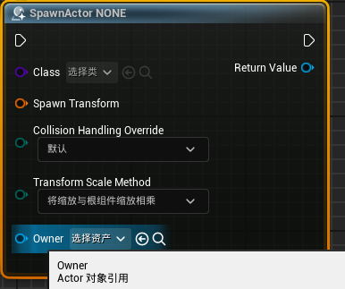

c++中，SpawnActor函数如下：

```cpp
SpawnActor( UClass* Class, FVector const& Location, FRotator const& Rotation, const FActorSpawnParameters& SpawnParameters = FActorSpawnParameters() )
```

查看FActorSpawnParameters：里面有一个Owner。与上面蓝图的Onwer指定是一致的。

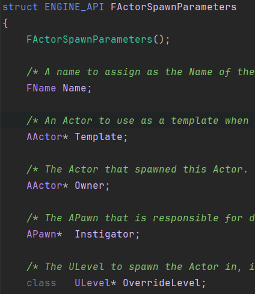

1. **第二种方式**

SetOwner/GetOwner

蓝图：

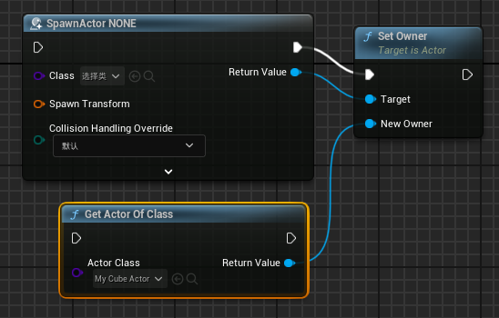

C++： `SetOwner( AActor* NewOwner );`

1. 第三种方式

Possess和Unpossess，不过Possess调用了OnPossess，调用了PossessedBy，调用了SetOwner，本质上和方法2是一样的。（不用看了）

# Actor Role 对象网络角色

Authority/Simulated Proxy/Autonomous Proxy

Server里有所有的玩家，且控制权限都是Authority；每个客户端也有所有的角色（只是代理），自己角色的控制权是Autonomous，其他玩家角色的控制权是Simulated。

Actor的同步无法每帧都进行，比如1s同步10次。因此simulated Proxy另一个作用是用插值方法弥补空白帧。

Role：获取某个Actor在当前端的角色；

Remote Role：获取某个Actor在某个远程机器（除自己以外的客户端/服务端）的角色。

举例：如果获取Role是Authority,并且RemoteRole是Autonomous或者Simulated，则说明当前游戏实例是运行在服务端的。

# RPC远程过程调用

本质上是不同的游戏实例之间的相互之间的调用，发出一个请求，远端函数调用回复请求。

可以实现客户端调用服务端执行，服务端调用客户端执行。

RPC无返回值且默认不可靠。

<aside>
💡

不同的进程间通信，不能阻塞直到有返回值，因此不设置返回值。（我不能游戏停在这等你响应吧）

</aside>

蓝图中：

我们使用”Custom Event“节点：

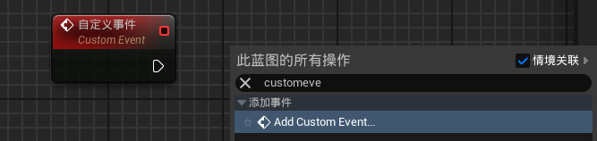

有三种模式：

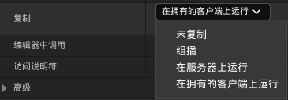

对于重要的函数：打上Reliable标记，对一些不重要的，比如显示个特效（看不看见没关系）不可靠就够用了。


**Server RPC**

| **Calling Machine** | **Owning Connection/Actor Role** | **Executing Machine** |
| --- | --- | --- |
| Server | Client | Server |
| Server | Server | Server |
| Server | None | Server |
| Client | Invoking Client | Server |
| Client | Different Client | Dropped |
| Client | Server | Dropped |
| Client | None | Dropped |

**Client RPC**

| **Calling Machine** | **Owning Connection/Actor Role** | **Executing Machine** |
| --- | --- | --- |
| Server | Owning Client | Owning Client |
| Server | Server | Server |
| Server | None | Server |
| Client | Invoking Client | Invoking Client |
| Client | Different Client | Invoking Client |
| Client | Server | Invoking Client |
| Client | None | Invoking Client |
|  |  |  |

**Net Multicast RPC**

| **Calling Machine** | **Owning Connection/Actor Role** | **Executing Machine** |
| --- | --- | --- |
| Server | Client | Server and all Clients the invoking actor is relevant for |
| Server | Server | Server and all Clients the invoking actor is relevant for |
| Server | None | Server and all Clients the invoking actor is relevant for |
| Client | Invoking Client | Invoking Client |
| Client | Different Client | Invoking Client |
| Client | Server | Invoking Client |
| Client | None | Invoking Client |

**RPC调用情况一：服务器  以组播形式  调用服务器端的RPC，查表得知，服务器和所有的客户端都会执行；**

**RPC调用情况二：服务器  以服务器形式  调用服务器端的RPC，查表得知，只会在服务器上执行；**

**RPC调用情况三：服务器  以客户端形式  调用服务器端的RPC，查表得知，只会在服务器上执行；**

### 从服务器调用的 RPC

| Actor 所有权 | 未复制 | `NetMulticast` | `Server` | `Client` |
| --- | --- | --- | --- | --- |
| **Client-owned actor** | 在服务器上运行 | 在服务器和所有客户端上运行 | 在服务器上运行 | 在 actor 的所属客户端上运行 |
| **Server-owned actor** | 在服务器上运行 | 在服务器和所有客户端上运行 | 在服务器上运行 | 在服务器上运行 |
| **Unowned actor** | 在服务器上运行 | 在服务器和所有客户端上运行 | 在服务器上运行 | 在服务器上运行 |

### 从客户端调用的 RPC

| Actor 所有权 | 未复制 | `NetMulticast` | `Server` | `Client` |
| --- | --- | --- | --- | --- |
| **Owned by invoking client** | 在执行调用的客户端上运行 | 在执行调用的客户端上运行 | 在服务器上运行 | 在执行调用的客户端上运行 |
| **Owned by a different client** | 在执行调用的客户端上运行 | 在执行调用的客户端上运行 | 丢弃 | 在执行调用的客户端上运行 |
| **Server-owned actor** | 在执行调用的客户端上运行 | 在执行调用的客户端上运行 | 丢弃 | 在执行调用的客户端上运行 |
| **Unowned actor** | 在执行调用的客户端上运行 | 在执行调用的客户端上运行 | 丢弃 | 在执行调用的客户端上运行 |

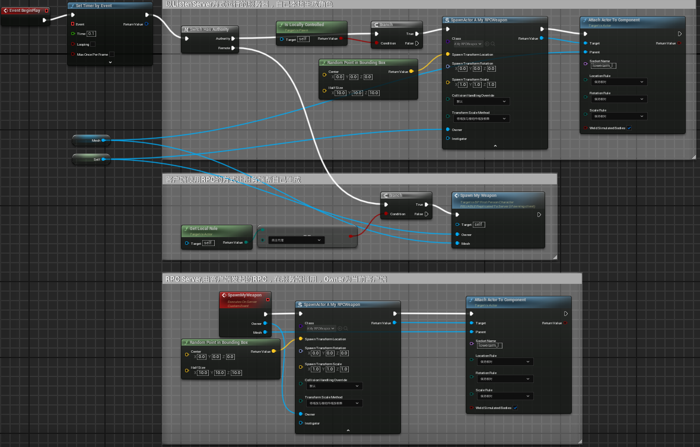

以生成武器为例：因为每个Actor开启了复制，如果服务器生成，同时客户端也调用的话，就会生成多余的Actor。因此在服务器端要检验是否是本地控制（位于服务器的”客户端“）

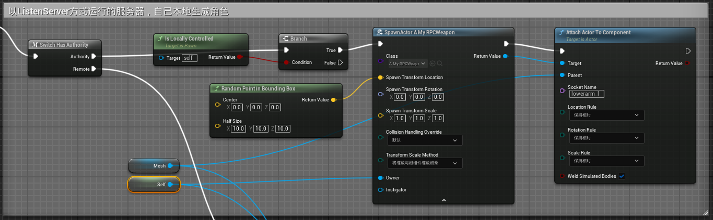

客户端在加入连接以后，使用RPC的方式让服务端帮自己生成，远端需要校验角色是Autonomous，所属是远端的客户端和网格体，因此都作为参数传给RPC。

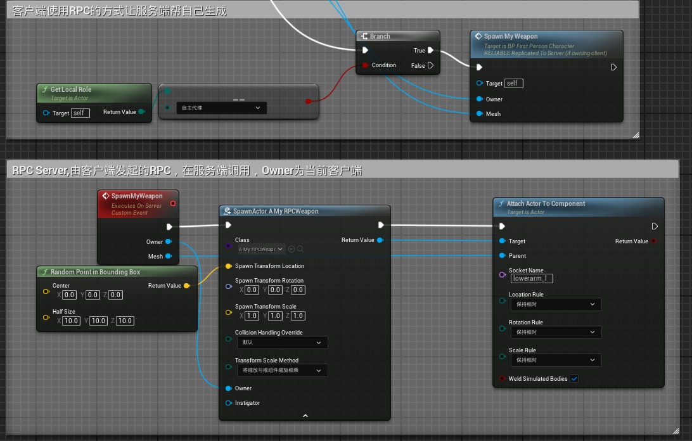

### 使用 RPC

要将一个函数声明为 RPC，您只需将 `Server`、`Client` 或 `NetMulticast` 关键字添加到 `UFUNCTION` 声明。

例如，若要将某个函数声明为一个要在服务器上调用、但需要在客户端上执行的 RPC，您可以这样做：

```cpp
UFUNCTION( Client )
	void ClientRPCFunction();
```

要将某个函数声明为一个要在客户端上调用、但需要在服务器上执行的 RPC，您可以采取类似的方法，但需要使用 `Server` 关键字：

```cpp
UFUNCTION( Server )
	void ServerRPCFunction();
```

此外，还有一种叫做多播（Multicast）的特殊类型的 RPC 函数。多播 RPC 可以从服务器调用，然后在服务器和当前连接的所有客户端上执行。 要声明一个多播函数，您只需使用 `NetMulticast` 关键字：

```cpp
UFUNCTION( NetMulticast )
	void MulticastRPCFunction();
```

多播 RPC 还可以从客户端调用，但这时就只能在本地执行。