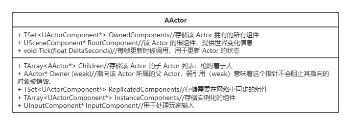

# 游戏模式

基本概念：游戏世界里组织数据和运作规则的方式。

# 万物之源-UObject

`UObject` 是 Unreal Engine 核心反射系统的基础类，几乎所有的引擎对象都从 `UObject` 或其子类继承。它为引擎提供了强大的功能，例如反射、序列化、垃圾回收和蓝图支持。同时还提供通用的属性和接口（如Equals,Clone,ToString等等）。

关于反射机制：

使得引擎能够在运行时查询和操作对象的属性和方法。

- 使用宏（如 `UCLASS`、`UPROPERTY` 和 `UFUNCTION`）标记类、属性和方法。
- 允许对象在运行时支持动态类型检查 (`IsA`) 和属性遍历。

类似原子组成物体一样，UE中的其他对象都由UObject家族组成。

## AActor

UObject的子类之一，用于表示场景中的物体，游戏中最重要的实体，也是网络同步的基础单位。

**Actor+ActorComponent**

物体的表达采用EC架构，一个实体和多种能力组合的“即插即用”的设计模式。

例如：ScenetComponent赋予Actor位置、旋转和缩放等空间变化信息。

同时还有标记本地权限的Role枚举：权威端（Authority，一般是服务器），主控端（AutonomousProxy，一般就是玩家自己），模拟端（SimulatedProxy，一般是其他客户端）。

### Actor的生命周期

首先提一下Actor分为静态和动态的，静态Actor来自于地图生成时关卡内的“环境物体”；动态Actor来自于本地Spawn（还有生成前先配置的Deffered手动生成方式）和网络序列化动态地生成。

[关于Actor的生成](关于Actor的生成.md)

生命周期概览：

1. **创建**：通过构造函数初始化，`OnConstruction` 设置初始状态。
2. **初始化组件**：组件初始化并执行 `PreInitializeComponents、InitializeComponents、PostInitializeComponents`。
3. **进入世界**：调用 `BeginPlay`，Actor 开始参与游戏逻辑。
4. **游戏进行**：`Tick` 每帧更新，处理游戏行为和网络同步。
5. **销毁前**：多种状态判断，调用 `EndPlay`，进行清理工作。
6. **销毁**：执行销毁操作，最后调用`BeginDestroy(标志)、IsReadyForDestroy（检查）、FinishDestroy（销毁）`  。销毁时注意有效性的判断return test && !test->IsPendingKill();`IsPendingKill()` 返回 `true` 时，表示对象已经进入销毁状态，不能再进行任何有效操作。

### APawn

是可操控的棋子。用于表示游戏中对象中的可控制角色。

既然说控制，那么APawn最重要的特点就是有控制器（Controller）这个属性。

- 通过PossessedBy函数绑定传入的控制器，这样就能处理各种动作指令。
- ReceivePossessed和ReceiveUnPossessed这俩虚函数专门用来处理 `Pawn` 被控制器接管或释放时的行为。
    - ReceivePossessed
        - 初始化与新控制器相关的逻辑。
        - 设置角色的状态（如玩家状态、AI 状态等）。
        - 开启输入或特定功能（如 UI 的显示或技能解锁）。
        - 在玩家进入某个 `Pawn` 或角色复活时，绑定与控制器相关的事件。
    - ReceiveUnPossessed
        - 清理控制器相关的状态或引用。
        - 禁用输入，防止角色在未被控制时仍然响应玩家或 AI 操作。
        - 执行特定的释放逻辑（如角色死亡、玩家退出等）。
        - 释放资源或解绑事件。

Apawn有一些常用的派生子类：

- 默认的ADefaultPawn：简单的球形碰撞，简单的外显，简单移动，基础手柄与键盘映射
- ASpectatorPawn：观察小人，首先肯定不可见没其次不受时间尺度影响（OB视角即使游戏暂停也能继续移动）

<aside>在虚幻基于事件驱动的架构中，对于输入输出的处理机制类似生产者-消费者模型。</aside>

**玩家输入设备**（如键盘、鼠标、游戏手柄）充当输入的**生产者**，它们“生产”用户的输入事件（例如按键、轴值变化等）。
**消费者**：

- `APawn` 及其组件（如运动组件 `MovementComponent`）是输入事件的主要消费者。
- 消费者根据输入事件触发相关的游戏逻辑，比如角色移动、攻击等。

#### ACharacter

进一步扩展了 `APawn`，为可移动的**人形角色**提供了高级功能，比如基于骨骼网格的动画支持和复杂的角色运动系统。
包括：

- 胶囊体碰撞盒组件（真实感和性能的balance结果）
- 骨骼组件：用于肢体动画、射击判定……
- 人物移动组件
    - 配合胶囊体可以完成跑、落、游、飞等多种仿真移动计算
    - 提供自定义移动模式扩展（爬墙、滑索、传送）
    - 网络“移动”同步步骤：
        - 主控端预表现
            - 主控端（拥有控制权的玩家）立即响应玩家输入，直接更新角色位置和动画，将移动数据（如位置、方向、速度等）发送给服务器。
        - 服务器端校验（物理规则，是否作弊），广播给其他客户端
        - 模拟端预测（使用插值的方式减少网络延迟带来的跳帧）
        
        <aside>
        💡UE的插值技术主要依赖于时间同步和位置计算，使用缓冲队列存储最近的状态更新，根据客户端时间在两个状态之间计算插值。
        
        
        
        

### AController

AController 的具体实现可能是 APlayerController（用于玩家）或 AAIController（用于 AI）。

通过Possess函数指定自己控制的Pawn，Pawn通过PossessedBy制定自己的主子，更新玩家状态和控制器。

#### APlayerController

专用于玩家的提线木偶操控者。仅仅存在于主控端和服务器端。

照样有UInputComponent绑定输入映射，增加APlayerCameraManager，其核心功能如下：

- **输入管理**：通过 `UInputComponent` 接收并处理玩家输入（如移动、攻击）。
- **角色控制**：可以直接控制 `APawn` 或 `ACharacter` 实例。
- **视角管理**：结合 `APlayerCameraManager` 管理玩家视角。
- **HUD 和交互**：与 `AHUD` 类交互，渲染用户界面和提供交互反馈。（逐渐被UMG取代）

**网络连接部分：**

- 每个 `APlayerController` 对应一个 `UNetConnection` 对象，该对象负责在服务器和客户端之间传递网络数据包。服务器通过 `APlayerController` 识别、追踪和管理每个玩家的网络连接。
- 主控端只能通过其拥有的 `APlayerController` 与服务器通信，确保连接安全性和独立性。

# AGameMode

仅服务器拥有，掌控整体游戏流程，纯服务器逻辑的运作。

**什么是游戏模式**？

- 定义和控制游戏**规则**。
- 管理玩家的加入、退出和重生。
- 控制游戏生命周期和流程。
- 在多人游戏中提供服务器端的权威逻辑。

AGmeMode和AGmaeModeBase:

前者是后者的子类，完善了对局和比赛的概念更适用于标准对抗类游戏。

<aside>
💡例如，在团队对战中，AGameMode可能会控制队伍的分配、得分规则、回合切换等。

# AGmaeState

**游戏状态**

所有端都共享同步的**游戏数据**通过该类进行多端传递。

AGmeState和AGmaeStateBase:

前者是后者的子类，完善了对局和比赛的概念更适用于标准对抗类游戏。

| **特性** | **AGameMode** | **AGameState** |
| :-: | :-: | :-: |
| **存在位置** | 仅存在于 **服务器端** | 在 **服务器端** 和 **所有客户端** 中都有存在 |
| **作用** | 管理游戏规则、逻辑和流程控制 | 存储并同步游戏的全局状态信息 |
| **生命周期管理** | 管理游戏的启动、结束、回合切换等 | 主要用于保持游戏状态信息并同步到客户端 |
| **玩家管理** | 负责玩家的加入、退出、重生等 | 不直接管理玩家，但同步玩家的状态信息 |
| **客户端访问** | 客户端无法直接访问 | 客户端可以直接访问和同步游戏状态数据 |
| **示例用途** | 定义游戏规则、胜负条件、回合控制 | 显示比分、计时器、玩家数量等全局状态 |

# APlayerState

顾名思义：单个玩家状态类，主要存储玩家的**个体信息**，如得分、名字、队伍、角色状态等。

> **APlayerState 和 AGameMode/APlayerController/AGameState 的关系**
> 
> - **与 `APlayerController`**：
>     - 每个玩家的 `APlayerController` 会持有一个指向其 `APlayerState` 的引用。
>     - `APlayerState` 由 `APlayerController` 管理，但其本身是全局可访问的。
>     - `APlayerController` 负责接收玩家输入并做出反应，而 `APlayerState` 存储玩家的长期状态（例如，得分、排名等）。
> - **与 `AGameMode`**：
>     - `AGameMode` 管理全局游戏规则、胜负条件、回合控制等，而 `APlayerState` 则处理具体玩家的状态和得分。
>     - `AGameMode` 通过 `AGameState` 和 `APlayerState` 控制游戏的流动性，例如，决定何时结束一局游戏，并通过 `APlayerState` 显示玩家的得分。
> - **与 `AGameState`**：
>     - `AGameState` 主要用于存储全局游戏信息并同步到所有客户端，而 `APlayerState` 则存储每个玩家的个人信息。
>     - `APlayerState` 中的数据会被同步到 `AGameState`，以便其他玩家能够看到（例如比分、排名）。

**PlayerState、Controller、Character的职责区别**

| **类** | **职责** | **存在位置** | **网络同步** | **与其他类的关系** |
| :-: | :-: | :-: | :-: | :-: |
| **`APlayerState`** | 存储和同步玩家的全局状态（如得分、排名、昵称等） | 服务器和客户端 | 是 | 与 `APlayerController` 配合存储玩家信息 |
| **`APlayerController`** | 处理玩家输入和角色控制，连接玩家与游戏世界 | 服务器和客户端 | 否 | 控制 `ACharacter` 或 `APawn`，与 `APlayerState` 配合 |
| **`ACharacter`** | 控制玩家的物理角色（如移动、跳跃等） | 服务器和客户端 | 否 | 被 `APlayerController` 控制，物理行为由 `UCharacterMovementComponent` 处理 |

# UE中对于世界规则的描述

预览窗口，编辑界面，游戏运行界面都视为不同的**World—UWorld**

引擎概念：关卡-**Level-ULevel**

<aside>
💡我们当然想要还原整个世界，限于硬件的限制，也是为了优化和模拟，得符合引擎的设计。
**关卡构成：**

持久性主关卡和子关卡

**关卡间切换/加载方式：**

LevelStreaming流式异步加载，如：

- WorldPartition in UE5
- WorldComposition
- LoadByLogic，基于基于玩家当前位置、关卡需求或游戏事件来动态加载和卸载关卡。

**关卡大小和加载距离：**

为了提升性能节省资源，一个“LOD”的做法，使用：

- LevelBounds：标识关卡的空间范围（对应的 Actor 类是 `ALevelBounds`，通常在关卡中自动生成）
- StreamingDistance：表示玩家到关卡中心的距离，当玩家距离小于设定值时（模拟真实世界的视野范围），关卡会加载；当距离大于设定值时，关卡会卸载。

**关卡规则：**

定义这“片”世界（或者说区域）的规则-关卡蓝图

## 在世界之上

引擎与真实世界的区别暴露在此：UGameInstance

用来保存非业务逻辑的全局管理操作如全局UI、配置文件、预加载内容，这些信息存在于整个游戏的生命周期，不会随着地图的切换和销毁而变化。

`UGameInstance` 的创建通常在游戏启动时完成，由引擎`UEngine`负责实例化并绑定到游戏世界（`UWorld`）。

问题：UE是如何拉起这个游戏世界的？

初始化-关卡-物体-玩家。引擎首先**`Init`**初始化必要的子系统资源(渲染、音频、输入)，创建UGameEngine类，然后 **`CreateLocalPlayer`** 创建本地玩家，接着由 **`SetupInitialLocalPlayer`** 关联本地玩家和客户端。在启动游戏这边，首先通过**`Browse`**找到新世界初始化的资源地址（URL）。通过**`OnStart`**初始化 **`UGameInstance`** 或 **`UGameMode`** ，**`Browse`**再调用**`LoadMap`**，过程中

- **`LoadPackage`**：加载与地图相关的所有包资源。
- **`UWorld::PostLoad`** 和 **`ULevel::PostLoad`**：在资源加载完毕后，执行后处理。
- **`UWorld::SetGameInstance`**：将当前的 `UGameInstance` 与新加载的 `UWorld` 进行绑定。
- **`UWorld::InitWorld`**：初始化新加载的世界。
- **`UWorld::SetGameMode`**：设置新世界中的游戏模式。
- **`UWorld::FlushLevelStreaming`**：确保所有流式加载的关卡被加载到内存。
- **`UWorld::InitializeActorsForPlay`**：初始化世界中的所有 Actor。
- **`ULocalPlayer::SpawnPlayActor`**：在所有世界和 Actor 初始化完成后，创建玩家角色。

**课程后半部分的源码解析略。**

**课后思考题：如果你来设计游戏，以下数据应该存放在哪里？是否需要同步给玩家？**

| 数据类型 | 存放位置 | 理由 | 是否同步给玩家 |
| --- | --- | --- | --- |
| **玩家血量** | `APlayerState` | 属于玩家个体信息 | 是 |
| **玩家得分** | `APlayerState` | 属于玩家个体信息 | 是 |
| **队友位置** | `ACharacter`  | 位置信息时刻在变动 | 是 |
| **毒圈** | `AGameState`  | 属于影响游戏世界的全局状态 | 是 |
| **空投信息** | `AGameState`  | 属于游戏世界的状态 | 是 |

<aside>
💡在 UE 中，ACharacter 继承自 APawn，使用 UCharacterMovementComponent 来处理移动和位置。因此，要获取 ACharacter 的位置信息，直接访问 ACharacter 或其父类 APawn 的 GetActorLocation()函数，会返回一个FVector表示角色的当前世界位置。

小思考：小地图那种显示队友位置的应该怎么做？

队友位置信息变成了玩家需要整局游戏都知晓的信息，需要用APlayerState去存储所有队友的Location？如果每个玩家只是存储自己的位置信息，可能需要在服务端维护玩家位置信息然后通过网络同步告知。。

