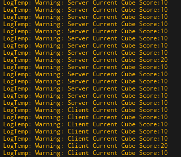

# 2024/11/26

主要解决问题：

- 在GameMode里存储X,Y,N,T可通过配置文件配置的变量。
- 游戏开始随机N个方块成为“重要目标”，射击命中后获得双倍积分。

**work1**：在GameMode里存储X,Y,N,T可通过配置文件配置的变量。

这里使用的是json文件格式：

```json
{
    "X": 10,
    "Y": 0.5,
    "N": 5,
    "T": 60
}
```

类文件中声明如下：

```cpp
	UPROPERTY(EditAnywhere,BlueprintReadWrite,Category="GameRule")
	int32 X;

	[[nodiscard]] int32 X1() const
	{
		return X;
	}

	void SetX(int32 newX)
	{
		this->X = X;
	}

	UPROPERTY(EditAnywhere, BlueprintReadWrite, Category = "GameRule")
	float Y;
	UPROPERTY(EditAnywhere, BlueprintReadWrite, Category = "GameRule")
	int32 N;
	UPROPERTY(EditAnywhere, BlueprintReadWrite, Category = "GameRule")
	int32 T;
```

从JSON文件中读取数据的操作封装为以下函数：

```cpp
void AMyFPSGameMode::LoadValuesFromJson()
{
	FString FilePath = FPaths::ProjectContentDir() + "Data/gamedata.json";
	UE_LOG(LogTemp, Log, TEXT("Attempting to load JSON file from: %s"), *FilePath);
	FString JsonContent;
	if (FFileHelper::LoadFileToString(JsonContent, *FilePath))
	{
	//创建一个 JSON 读取器（TJsonReader），并将 JsonContent 作为参数传入该读取器以进行解析。返回的 Reader 是一个智能指针，确保读取器的内存管理。
		TSharedRef<TJsonReader<TCHAR>> Reader = TJsonReaderFactory<TCHAR>::Create(JsonContent);
		//Json对象
		//智能指针将表示一个 JSON 对象。使用TSharedPtr 管理内存，确保在不再需要时自动释放 FJsonObject，避免内存泄漏。
		TSharedPtr<FJsonObject> JsonObject;
		//将Json文件反序列化，成功的话，Json数据会保存到JsonObject里
		if (FJsonSerializer::Deserialize(Reader, JsonObject) && JsonObject.IsValid())
		{
		//读取数据
			X = JsonObject->GetNumberField(TEXT("X"));
			Y = JsonObject->GetNumberField(TEXT("Y"));
			N = JsonObject->GetNumberField(TEXT("N"));
			T = JsonObject->GetNumberField(TEXT("T"));
			UE_LOG(LogTemp, Log, TEXT("X: %d, Y: %f, N: %d, T: %d"), X, Y, N, T);
		}
		else
		{
			UE_LOG(LogTemp, Log, TEXT("Failed to parse JSON"));
		}
	}
	else
	{
		UE_LOG(LogTemp, Log, TEXT("Failed to load JSON file"));
	}
}
```

之后再BeginPlay中美美调用即可。

**work2**：构建MyCubeActor，主要存储两个变量，一个bool表示自己是否是重要方块（后续可以根据这个上材质或者别的操作）；一个int32表示自己的分数。几个注意点：

- Actor是多人联机共享的，因此要设置bReplicates=true；
- UPROPERTY也需要网络复制。

```cpp
// Fill out your copyright notice in the Description page of Project Settings.

#pragma once

#include "CoreMinimal.h"
#include "GameFramework/Actor.h"
#include "MyCubeActor.generated.h"

UCLASS()
class MYFPS_API AMyCubeActor : public AActor
{
	GENERATED_BODY()
	
public:	
	// Sets default values for this actor's properties
	AMyCubeActor();

protected:
	// Called when the game starts or when spawned
	virtual void BeginPlay() override;
	UPROPERTY(EditAnywhere, BlueprintReadWrite, Category = "Components")
	TObjectPtr<UStaticMeshComponent> StaticMeshComponent;

public:	
	// Called every frame
	virtual void Tick(float DeltaTime) override;
	void GetLifetimeReplicatedProps(TArray<FLifetimeProperty>& OutLifetimeProps )const;
	UPROPERTY(Replicated,EditAnywhere, BlueprintReadWrite,Category = "Attributes")
	bool important = false;
	UPROPERTY(Replicated,EditAnywhere, BlueprintReadWrite,Category = "Attributes")
	int32 score = 0;

	[[nodiscard]] int32 Score() const
	{
		return score;
	}

	void SetScore(int32 Score)
	{
		score = Score;
	}

	[[nodiscard]] bool Important() const
	{
		return important;
	}

	void SetImportant(bool bImportant)
	{
		important = bImportant;
	}
};
//CPP
#include "MyCubeActor.h"

#include "Kismet/GameplayStatics.h"
#include "MyFPS/MyFPSGameMode.h"
#include "Net/UnrealNetwork.h"

// Sets default values
AMyCubeActor::AMyCubeActor()
{
	// Set this actor to call Tick() every frame.  You can turn this off to improve performance if you don't need it.
	PrimaryActorTick.bCanEverTick = true;
	bReplicates = true;
	StaticMeshComponent = CreateDefaultSubobject<UStaticMeshComponent>(TEXT("StaticMeshComponent"));
	RootComponent = StaticMeshComponent;

	StaticMeshComponent->SetSimulatePhysics(true);
}

// Called when the game starts or when spawned
void AMyCubeActor::BeginPlay()
{
	Super::BeginPlay();
}

// Called every frame
void AMyCubeActor::Tick(float DeltaTime)
{
	Super::Tick(DeltaTime);
	//if (HasAuthority())
	//{
		//UE_LOG(LogTemp, Warning, TEXT("Server Current Cube Score:%d"), score);
	//}else
	//{
		//UE_LOG(LogTemp, Warning, TEXT("Client Current Cube Score:%d"), score);
	//}
}

void AMyCubeActor::GetLifetimeReplicatedProps(TArray<FLifetimeProperty>& OutLifetimeProps) const
{
	Super::GetLifetimeReplicatedProps(OutLifetimeProps);
	DOREPLIFETIME(AMyCubeActor, important);
	DOREPLIFETIME(AMyCubeActor, score);
}
```

**work3**：随机挑选N个方块，使其成为重要方块，score*2。首先生成长度为N的随机数数组。遍历场景中的所有方块，如果其索引在随机数数组中，则成为重要方块。注意使用智能指针和各种有效性验证。

```cpp
void AMyFPSGameMode::RandomlyDoubleScores()
{
	TArray<AActor*> AllActors;
	UGameplayStatics::GetAllActorsOfClass(GetWorld(), AMyCubeActor::StaticClass(), AllActors);
	TArray<int32> ChosenIndexes;
	while (ChosenIndexes.Num() < N)
	{
		int32 RandomIndex = FMath::RandRange(0, AllActors.Num() - 1);
		if (ChosenIndexes.Contains(RandomIndex))
		{
			continue;
		}
		ChosenIndexes.Add(RandomIndex);
		TObjectPtr<AMyCubeActor> MyActor = Cast<AMyCubeActor>(AllActors[RandomIndex]);
		if (MyActor)
		{
			MyActor->SetScore(2 * X);
			MyActor->SetImportant(true);
			UE_LOG(LogTemp, Log, TEXT("GameMode MyCubeActor %d important score doubled to: %d"), RandomIndex,
			       MyActor->Score());
		}
	}
	for (int32 i = 0; i < AllActors.Num(); i++)
	{
		if (!ChosenIndexes.Contains(i))
		{
			TObjectPtr<AMyCubeActor> MyActor = Cast<AMyCubeActor>(AllActors[i]);
			if(MyActor)
			{
				MyActor->SetScore(X);
				MyActor->SetImportant(false);
				UE_LOG(LogTemp, Log, TEXT("GameMode MyCubeActor %d normal score to: %d"), i, MyActor->Score());
			}
		}
	}
}

```




数据在服务端和客户端都进行了统一。