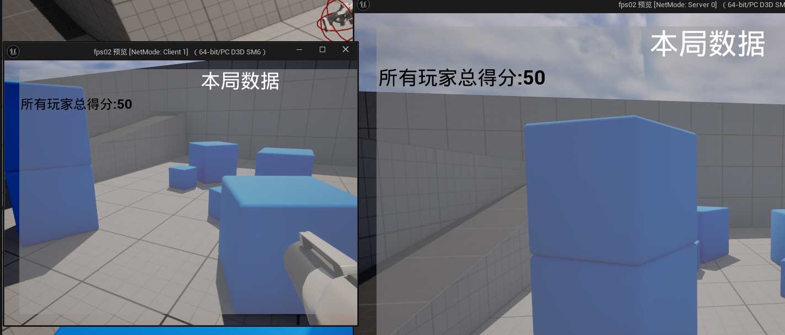

# 2024/12/3

主要解决问题：

- 射击命中方块后，方块缩小为Y倍
- 游戏倒计时T秒后，游戏结算
- 游戏结算UI同步-总分部分

**work01：**本来直接尝试缩小，企图利用复制直接实现同步，发现不可行，缩放属性并没有复制同步，因此采用RPC方式。具体来说，对于服务端，本地调用Scale函数，然后组播到其他所有客户端；对于客户端直接委托给服务端干这个事儿。综合一下就是统一使用Server RPC。

```cpp
if (MyPawn->HasAuthority())
							{
								if (MyCube->Health() <= 0)
								{
									MyPlayerState->UpDateScore(MyCube->Score());
									MyCube->DestroyCube();
								}
								else
								{
									//MyCube->ServerHandleCubeScale();
									MyCube->ScaleCube();
									MyCube->MulticastScaleCube();
								}
							}
							else
							{
								if (MyCube->Health() <= 0)
								{
									MyPlayerState->UpDateScore(MyCube->Score());
									MyPlayerController->ServerHandleCubeDamage(MyCube);
								}
								else
								{
									MyCube->ServerHandleCubeScale();
								}
							}
```

这里客户端调用的时候，无法广播到其他客户端，会报警告：

**LogNet: Warning: UNetDriver::ProcessRemoteFunction: No owning connection for actor A_Cube_C_UAID_040E3C31633B193402_2015810818. Function ServerHandleCubeScale will not be processed.**

Actor不直接拥有连接，客户端没法操纵不属于他连接的对象，考虑把RPC写在playercontroller里解决了这个警告。

```cpp
MyPlayerController->ServerHandleCubeScale(MyCube);
```

**work02：**游戏倒计时T秒后，游戏结算，不直接使用tick函数，使用FTimerHandle进行倒计时管理。

GmaeMode导入的时候设置游戏状态里的倒计时参数。

```cpp
void AMyGameMode::SetGameTime()
{
	TObjectPtr<AMyGameState> MyGameState=Cast<AMyGameState>(GameState);
	MyGameState->SetCountdownTime(T);
}
```

游戏状态里：

```cpp
	UPROPERTY(BlueprintReadOnly,VisibleAnywhere,Category = "Game Settings")
	FTimerHandle TimerHandle;
	UFUNCTION()
	void StartCountdown();
	UFUNCTION()
	void UpdateCountdown();
	UFUNCTION(BlueprintCallable)
	void EndGame();
```

这里注意只在服务端进行倒计时：

```cpp
void AMyGameState::BeginPlay()
{
	Super::BeginPlay();
	if (HasAuthority())
	{
		StartCountdown();
	}
}
```

以1秒为间隔，开启定时器，每次更新时T-1；当倒计时结束时，进入游戏结算画面，这里额外获取所有玩家并禁用他们的输入。

```cpp
void AMyGameState::StartCountdown()
{
	if (!GetWorld()->GetTimerManager().IsTimerActive(TimerHandle))
	{
		GetWorld()->GetTimerManager().SetTimer(TimerHandle, this, &AMyGameState::UpdateCountdown, 1.0f, true);
	}
}

void AMyGameState::UpdateCountdown()
{
	if (CountdownTime > 0)
	{
		CountdownTime -= 1;
		UE_LOG(LogTemp, Warning, TEXT("游戏剩余时间: %d "), CountdownTime);
	}
	else
	{
		EndGame(); // 倒计时结束时进入游戏结算画面
	}
}

void AMyGameState::EndGame()
{
	if (GetWorld()->GetTimerManager().IsTimerActive(TimerHandle))
	{
		GetWorld()->GetTimerManager().ClearTimer(TimerHandle);
	}
	for (TObjectPtr<AMyPlayerState> Player : AllPlayersState)
	{
		TotalScore += Player->GetScore();
	}
	for (FConstPlayerControllerIterator it = GetWorld()->GetPlayerControllerIterator(); it; it++)
	{
		Afps02PlayerController* PlayerController = Cast<Afps02PlayerController>(it->Get());
		if (PlayerController )
		{
			PlayerController->SetInputMode(FInputModeUIOnly());
			Afps02Character* MyPawn = Cast<Afps02Character>(PlayerController->GetPawn());
			if (MyPawn)
			{
				MyPawn->DisableInput(nullptr);
				
			}
			PlayerController->ClientDisableInput();
			
		}
	}
}
```

这里有一个Client RPC：

```cpp
void Afps02PlayerController::ClientDisableInput_Implementation()
{
	Afps02Character* MyPawn = Cast<Afps02Character>(GetPawn());
	if (MyPawn)
	{
		MyPawn->DisableInput(this);
		SetInputMode(FInputModeUIOnly());
	}
}
```

**work03：**结算UI同步总分。



UMyGameOverWidget ：

```cpp
// Fill out your copyright notice in the Description page of Project Settings.

#pragma once

#include "CoreMinimal.h"
#include "Blueprint/UserWidget.h"
#include "MyGameOverWidget.generated.h"

/**
 * 
 */
class UTextBlock;
UCLASS()
class FPS02_API UMyGameOverWidget : public UUserWidget
{
	GENERATED_BODY()
	
public:
	UFUNCTION(BlueprintCallable,Category="Game Over")
	void SetTotalScore(int32 totalScore);
	UPROPERTY(Replicated,meta = (BindWidget))
	UTextBlock* ScoreText;
	virtual void NativeConstruct() override;
	
};

```

注意点1：Widegt不要写构造函数，初始化写在NativeConstruct函数里。

注意点2：绑定的做法：使用meta = (BindWidget)，同时把编辑器里要绑定的文本框重命名和类里变量名一致。

```cpp
// Fill out your copyright notice in the Description page of Project Settings.
#include "MyGameOverWidget.h"
#include "Components/TextBlock.h"
#include "Net/UnrealNetwork.h"

void UMyGameOverWidget::SetTotalScore(int32 totalScore)
{
	if(totalScore)
	{
			ScoreText->SetText(FText::AsNumber(totalScore));
	}
}

void UMyGameOverWidget::NativeConstruct()
{
	Super::NativeConstruct();
	if (ScoreText)
	{
		ScoreText->SetText(FText::AsNumber(0));
	}
}
void UMyGameOverWidget::GetLifetimeReplicatedProps(TArray<FLifetimeProperty>& OutLifetimeProps) const
{
	Super::GetLifetimeReplicatedProps(OutLifetimeProps);
	DOREPLIFETIME(UMyGameOverWidget, ScoreText);
}
```

最后想了一下也可以不禁用玩家输入了，反正不对结果造成任何影响。。如果要设置按钮功能的话再说。