# 2024/12/4

主要解决问题：

- 玩家得分同步UI面板展示
- 玩家游戏中得分同步，倒计时同步

**work01**：一开始想着直接在主面板里添加滚动框，然后来一个创建一个水平框再添加到滚动框里，然后酱紫做要在代码里设置各个框的格式，调了半天不太行。。。于是借鉴以前设计UMG的经验，把滚动框里的内容拆出来，新作一个控件，滚动框添加的时候添加的是这个控件，所有的格式在控件蓝图里调即可，c++逻辑只专注于数据绑定。

设计页面如下：

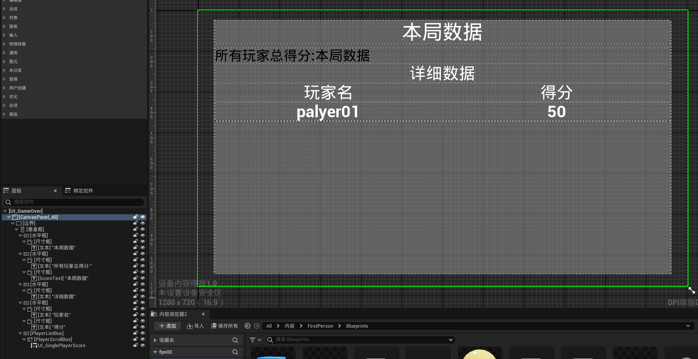

子页面：

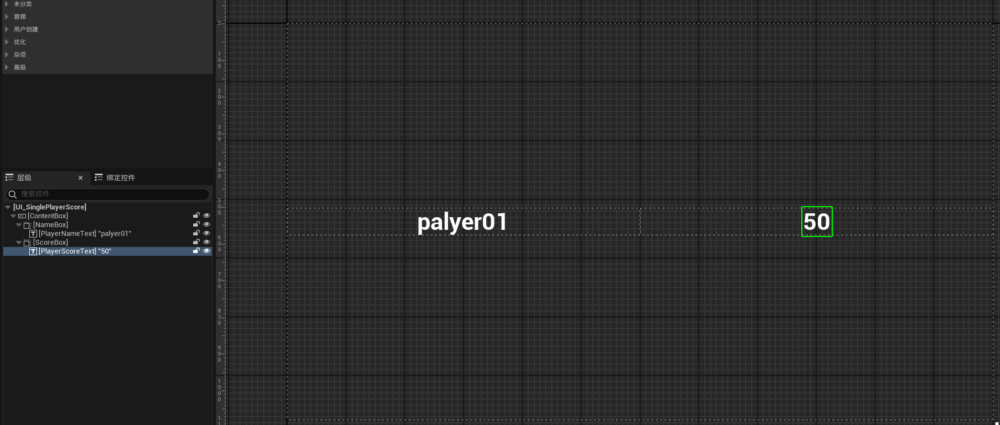

在父页面里指定子类：

```cpp
	UPROPERTY(EditAnywhere, BlueprintReadWrite, Category = "Game Over")
	TSubclassOf<UUserWidget> SinglePlayerWidgetClass;
```

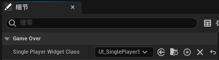

子类关键代码：

```cpp
UCLASS()
class FPS02_API UMyPlayerScoreWidget : public UUserWidget
{
	GENERATED_BODY()
	
public:
	virtual void NativeConstruct() override;
	UPROPERTY(Replicated,meta = (BindWidget))
	UTextBlock* PlayerNameText;
	UPROPERTY(Replicated,meta = (BindWidget))
	UTextBlock* PlayerScoreText;
	UFUNCTION(BlueprintCallable,Category="Game Over")
	void SetPlayerScore(const FPlayerScoreData& PlayerScore);
};
//CPP
void UMyPlayerScoreWidget::NativeConstruct()
{
	Super::NativeConstruct();
}

void UMyPlayerScoreWidget::SetPlayerScore(const FPlayerScoreData& PlayerScore)
{
	PlayerNameText->SetText(FText::FromString(PlayerScore.Name));
	PlayerScoreText->SetText(FText::AsNumber(PlayerScore.Score));
}

void UMyPlayerScoreWidget::GetLifetimeReplicatedProps(TArray<FLifetimeProperty>& OutLifetimeProps) const
{
	Super::GetLifetimeReplicatedProps(OutLifetimeProps);
	DOREPLIFETIME(UMyPlayerScoreWidget, PlayerNameText);
	DOREPLIFETIME(UMyPlayerScoreWidget, PlayerScoreText);
}
```

更所有玩家得分的函数就继续压缩成：

```cpp
void UMyGameOverWidget::SetPlayerScores(const TArray<FPlayerScoreData>& PlayerScores)
{
	PlayerScrollBox->ClearChildren();
	for (const FPlayerScoreData& PlayerScoreData : PlayerScores)
	{
		if (SinglePlayerWidgetClass) 
		{
			TObjectPtr<UMyPlayerScoreWidget> SinglePlayer = CreateWidget<UMyPlayerScoreWidget>(
				this, SinglePlayerWidgetClass);
			SinglePlayer->SetPlayerScore(PlayerScoreData);
			PlayerScrollBox->AddChild(SinglePlayer);
		}
	}
}
```

最终效果：这里按分数从高到低排了个序。

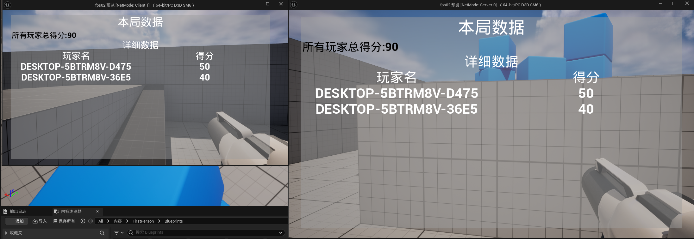

**work02：**按照前面的思路继续做，制作一个局内展示UI:

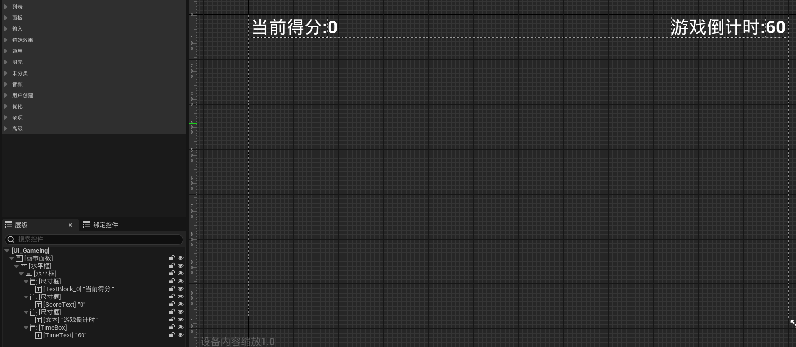

这里绑定得分ScoreText和倒计时TimeText。

```cpp
class FPS02_API UMyProgressWidget : public UUserWidget
{
	GENERATED_BODY()
public:
	virtual void NativeConstruct() override;
	UPROPERTY(Replicated,meta = (BindWidget))
	UTextBlock* ScoreText;
	UPROPERTY(Replicated,meta = (BindWidget))
	UTextBlock* TimeText;
	UFUNCTION(BlueprintCallable,Category="Game Ing")
	void UpdateScore(int32 NewScore);
	UFUNCTION(BlueprintCallable,Category="Game Ing")
	void UpdateTime(int32 NewTime);
};
```

在GameState里赋值：

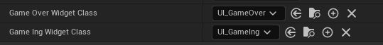

- 倒计时更新方法：在之前倒计时计算的基础上，自行加一下复制通知函数

```cpp
void AMyGameState::UpdateCountdown()
{
	if (CountdownTime > 0)
	{
		CountdownTime -= 1;
		OnRep_Time();
		//UE_LOG(LogTemp, Warning, TEXT("游戏剩余时间: %d "), CountdownTime);
	}
	else
	{
		EndGame(); // 倒计时结束时进入游戏结算画面
	}
}
```

让每个本地玩家控制器同步更新时间。

```cpp
void AMyGameState::OnRep_Time()
{
	for (FConstPlayerControllerIterator it = GetWorld()->GetPlayerControllerIterator(); it; ++it)
	{
		Afps02PlayerController* PlayerController = Cast<Afps02PlayerController>(it->Get());
		if (PlayerController && PlayerController->IsLocalController() && PlayerController->GameIngWidget)
		{
			PlayerController->GameIngWidget->UpdateTime(CountdownTime);
		}
	}
}
```

更新分数这里有所不同：因为Score属性存在PlayerState里了，因此这里我们把逻辑写在PlayerState里的分数复制通知函数里：还是通过PlayerController更新面板

```cpp
void AMyPlayerState::OnRep_Score()
{
	UE_LOG(LogTemp, Warning, TEXT("玩家%s 当前得分:%f"), *GetPlayerName(), GetScore());

	if (TObjectPtr<Afps02PlayerController> PlayerController = Cast<Afps02PlayerController>(GetPlayerController()))
	{
		PlayerController->UpdateGameIngWidgetScore();
	}
}
```

在 `OnRep_Score()` 中直接访问 `GameIngWidget` 可能会因为某些条件（如初始化顺序）导致崩溃。将对 `GameIngWidget` 的更新操作放在 `Afps02PlayerController` 内部的方法中避免崩溃。

```cpp
void Afps02PlayerController::UpdateGameIngWidgetScore()
{
	if(GameIngWidget)
	{
		TObjectPtr<AMyPlayerState> MyPlayerState=GetPlayerState<AMyPlayerState>();
		if(PlayerState)
		{
			GameIngWidget->UpdateScore(PlayerState->GetScore());
		}
	}
}
```

当然，加了验证之后，这样写也是可以的：

```cpp
		if (PlayerController->GameIngWidget)
		{
			PlayerController->GameIngWidget->UpdateScore(GetScore());
		}
```

别忘了在游戏结算的时候移除局内UI：

```cpp
			if (PlayerController->GameIngWidget)
			{
				PlayerController->GameIngWidget->RemoveFromParent(); // 从视图中移除
				PlayerController->GameIngWidget = nullptr;
			}
```

综合效果截图如下：

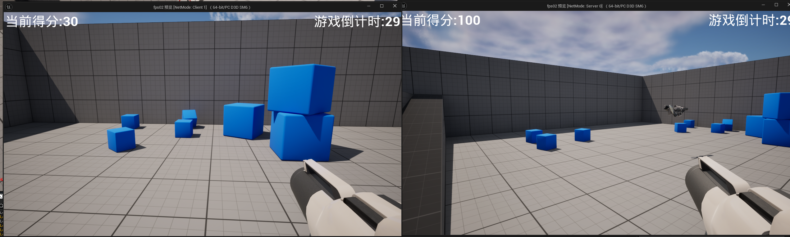

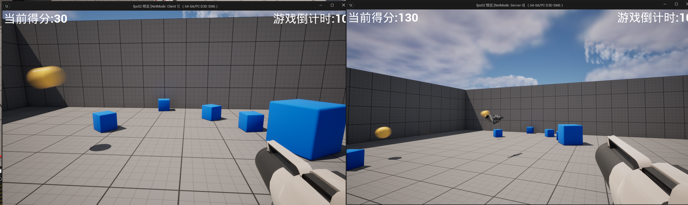

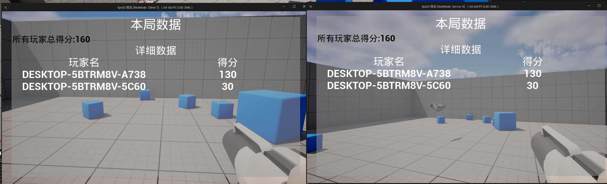

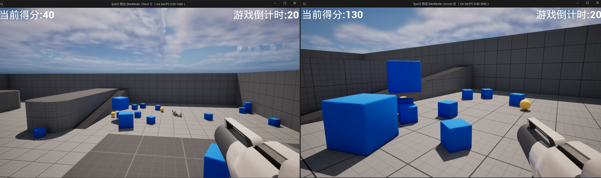

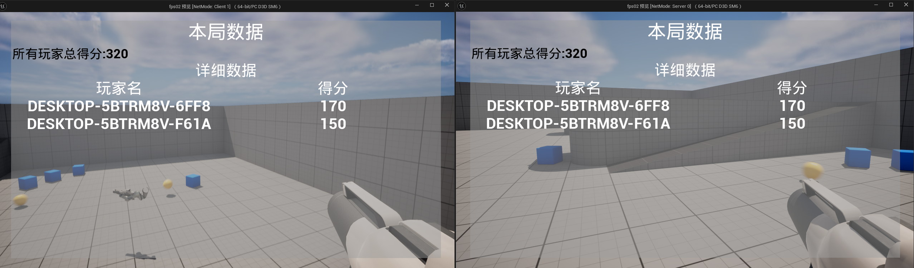

和之前的日志输出形式也是数据一致的：

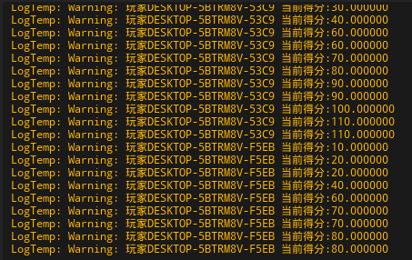