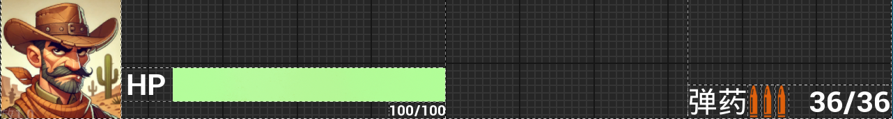
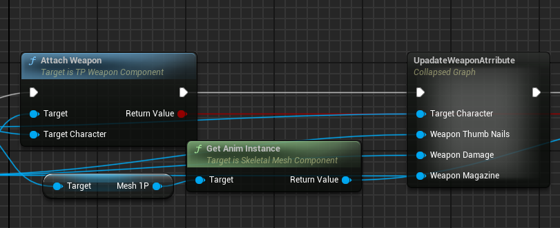
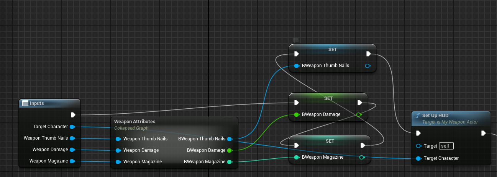
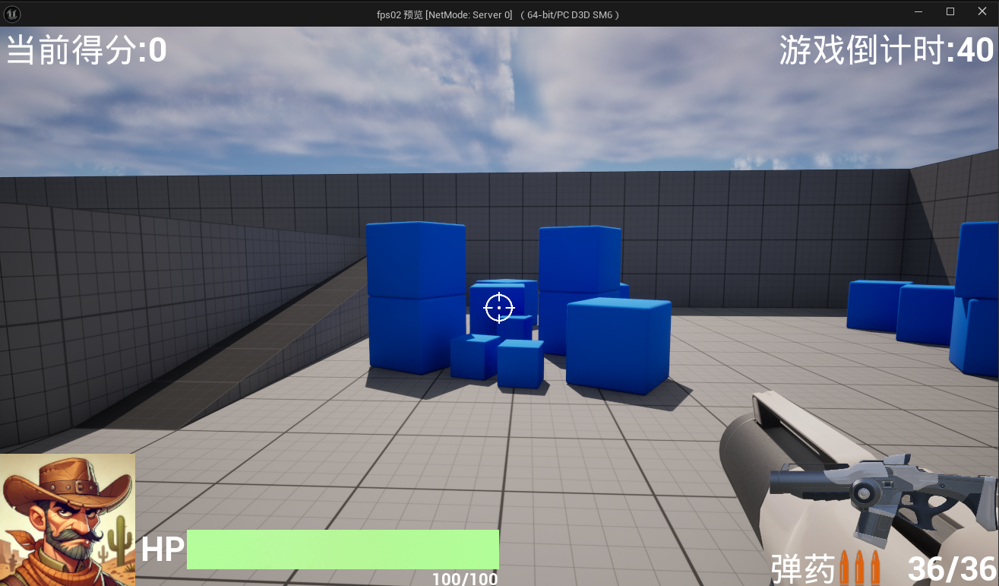
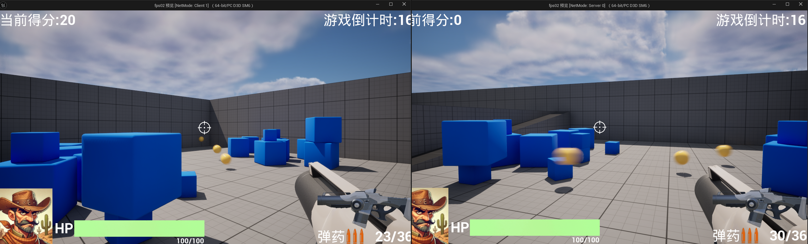

# 2024/12/22

主要解决问题：

- 人物血条和弹药数量

# work01：HUD制作

包括血条和弹药：



放在屏幕的下方。

逻辑梳理：

1. 在没捡到枪之前，弹药配比0/0，捡到枪之后，将枪的弹药配比同步到UI上。
2. 同步枪的缩略图，大小：440*185

重新写了一个WeaponActor，原来那个没有C++类用起来不方便。。。

在Weapon Actor和Weapon Component里添加如下属性：

```cpp
	//武器属性
	UPROPERTY(EditAnywhere,BlueprintReadWrite,Category="Weapon")
	float BWeaponDamage;
	UPROPERTY(EditAnywhere,BlueprintReadWrite,Category="Weapon")
	int32 BWeaponMagazine;
	UPROPERTY(EditAnywhere,BlueprintReadWrite,Category="Weapon")
	UTexture2D* BWeaponThumbNails;
```





更新UI函数：

```cpp
void AMyWeaponActor::SetUpHUD(Afps02Character* TargetCharacter)
{
	Afps02Character* Character=TargetCharacter;
	TObjectPtr<Afps02PlayerController> PlayerController = Cast<Afps02PlayerController>(Character->GetController());
	if (PlayerController)
	{
		if (PlayerController->IsLocalController())
		{
			PlayerController->ServerAddCross();
			PlayerController->ServerAddMyHUD();
			PlayerController->ServerUpdateGunMagazine(GetBWeaponMagazine());
			PlayerController->ServerUpdateGunThumbNails(GetBWeaponThumbNails());
		}
	}
}
```

捡到枪以后执行以上逻辑：



1. 开火机制补充：玩家开火子弹数-1，如果子弹数为0则无法开火；（不会播放动画和音效）

在组件开火函数里补充如下逻辑：

```cpp
int32 CurrentBulletNum=ParentActor->GetBWeaponCurrentBulletNum();
		if(CurrentBulletNum>0)
		{
			TObjectPtr<Afps02PlayerController> PlayerController = Cast<Afps02PlayerController>(Character->GetController());
			// PlayerController
			ParentActor->UpdateGunBulletNum(ParentActor->GetBWeaponCurrentBulletNum()-1);
			PlayerController->ServerUpdateGunBulletNum(ParentActor->GetBWeaponCurrentBulletNum());
			…………
			………………
			}
```

只有当前子弹大于0时才能执行生成子弹，播放音效和动画。这里做了两个操作，将枪本身的子弹数据更新和将UI上的子弹数据同步更新。UI更新逻辑还是一样：

```cpp

void Afps02PlayerController::ClientUpdateGunBulletNum_Implementation(int32 BulletNum)
{
	UpdateGunBulletNum(BulletNum);
}

void Afps02PlayerController::ServerUpdateGunBulletNum_Implementation(int32 BulletNum)
{
	ClientUpdateGunBulletNum(BulletNum);
}

void Afps02PlayerController::UpdateGunBulletNum(int32 BulletNum)
{
	if(MyHUDWidget)
	{
		MyHUDWidget->UpdateCurrentBulletNum(BulletNum);
	}
}
```

当前效果：



（进一步设计：场景内散落弹药包可用来补充或扩容弹夹）