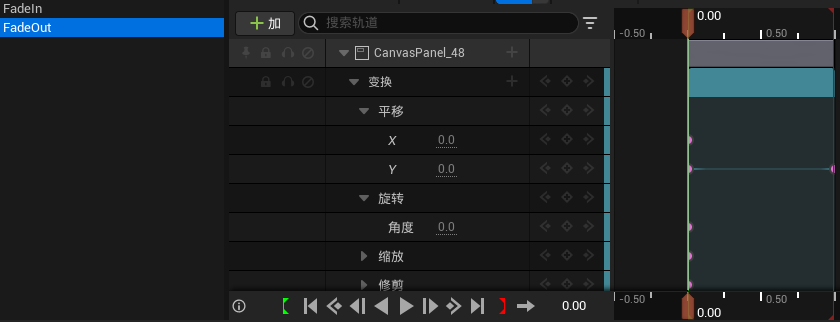
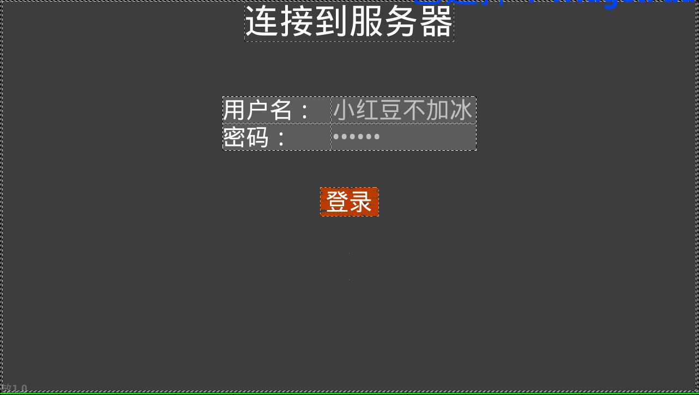

# 2024/12/19

主要解决问题：

- 各个UI淡入淡出动画
- 登录界面

# **work01**：UI淡入淡出动画

目前有四个UI，计划给上简单的淡入淡出动画。



时间控制在1s左右。在蓝图里弄完后在C++里绑定一下：

```cpp
	UPROPERTY(Transient,meta = (BindWidgetAnim))
	UWidgetAnimation* FadeIn;
	
	UPROPERTY(Transient,meta = (BindWidgetAnim))
	UWidgetAnimation* FadeOut;
```

顺便封装一下销毁函数，这里因为要播放动画，因此要延迟一些时间再移除UI。

```cpp
void UMyProgressWidget::removeWidget()
{
	if (FadeOut)
	{
		PlayAnimation(FadeOut); // 播放动画
		FTimerHandle TimerHandle;
		GetWorld()->GetTimerManager().SetTimer(TimerHandle, this, &UMyProgressWidget::RemoveFromParent, 1.0f, false); // 延迟1秒移除
	}
	else
	{
		RemoveFromParent();
	}
}
```

在UI创建时播放UI动画则不需要延时：

```cpp
UWidgetAnimation* FadeInAnim = PlayerController->GameOverWidget->FadeIn;
		if (FadeInAnim)
				{
						PlayerController->GameOverWidget->PlayAnimation(FadeInAnim); // 播放动画
				}
```

这里在游戏结算页面，为了增加一点美观性，企图将玩家得分一条一条录入得分展示面板，用到了Lambda表达式配合定时器，创建代理指向我们想要的操作（Lambda函数），在函数中我们播放动画，再添加到Scrollbox里，每次时延增加（DelayInterval * index）：

```cpp
void UMyGameOverWidget::SetPlayerScores(const TArray<FPlayerScoreData>& PlayerScores)
{
	PlayerScrollBox->ClearChildren(); // 清空ScrollBox中的所有子控件
	float DelayInterval = 1.0f; // 每个小部件之间的延迟时间，单位为秒
	int32 index = 1;
	for (const FPlayerScoreData& PlayerScoreData : PlayerScores)
	{
		//UE_LOG(LogTemp, Log, TEXT("Player Name: %s, Score: %d"), *PlayerScoreData.Name, PlayerScoreData.Score);
		if (SinglePlayerWidgetClass)
		{
			// 创建玩家得分小部件
			TObjectPtr<UMyPlayerScoreWidget> SinglePlayer = CreateWidget<UMyPlayerScoreWidget>(
				this, SinglePlayerWidgetClass);
			// 设置玩家得分
			SinglePlayer->SetPlayerScore(PlayerScoreData);
			FTimerHandle TimerHandle;
			GetWorld()->GetTimerManager().SetTimer(TimerHandle, FTimerDelegate::CreateLambda([this, SinglePlayer]()
			{
				UWidgetAnimation* FadeInAnim = SinglePlayer->FadeIn;
				if (FadeInAnim)
				{
					SinglePlayer->PlayAnimation(FadeInAnim);
				}
				PlayerScrollBox->AddChild(SinglePlayer);
			}), DelayInterval * index, false);

			index++;
		}
	}
}
```

# work02：登录界面

UI制作：



用户输入自己的用户名和密码，发送给服务端进行校验，目前用户的姓名和密码都存在JSon文件里，GameMode初始化时和其他数据一起导入。

```cpp

FLoginResult AMyGameMode::ValidateAccount(const FString& Username, const FString& Password)
{
	const FString* StoredPassword = AccountPasswordMap.Find(Username);
	if (StoredPassword && *StoredPassword == Password)
	{
		//UE_LOG(LogTemp,  Warning, TEXT("用户登录成功: %s"), *Username);
		return FLoginResult(true, TEXT("登录成功"));  // 登录成功，返回空信息
	}
	if(!StoredPassword)
	{
		//UE_LOG(LogTemp, Warning, TEXT("该用户尚未注册，请管理员注册此用户: %s"), *Username);
		return  FLoginResult(false, TEXT("用户不存在"));  // 用户不存在
	}else
	{
		//UE_LOG(LogTemp, Warning, TEXT("密码输入错误！"));
		return  FLoginResult(false, TEXT("密码错误"));  // 密码错误
	}
}
```

将登录结果返回给客户端，客户端在UI上告知登录结果。

登陆成功的用户同时重命名：

```cpp
void Afps02PlayerController::ServerValidateLogin_Implementation(const FString& PlayerName, const FString& PlayerCode)
{
	AMyGameMode* GameMode = Cast<AMyGameMode>(UGameplayStatics::GetGameMode(this));
	if (GameMode)
	{
		FLoginResult State = GameMode->ValidateAccount(PlayerName, PlayerCode);
		if (State.bIsValid)
		{
			TObjectPtr<AMyPlayerState> MyPlayerState = GetPlayerState<AMyPlayerState>();
			if (MyPlayerState)
			{
				MyPlayerState->SetIsLoggedIn(true);
				MyPlayerState->SetBMyName(PlayerName);
				//UE_LOG(LogTemp, Warning, TEXT("玩家: %s"), *MyPlayerState->GetBMyName());
			}
		}
		ClientNotifyLoginResult(State);
	}
}
```

Client通知函数：

```cpp
void Afps02PlayerController::ClientNotifyLoginResult_Implementation(const FLoginResult& LogInfo)
{
	TObjectPtr<Afps02PlayerController> PlayerController = Cast<Afps02PlayerController>(this);
	if (PlayerController)
	{
		if (PlayerController->LogInWidget)
		{
			if (LogInfo.bIsValid)
			{
				PlayerController->LogInWidget->OnLoginSuccess(LogInfo);
				FInputModeGameOnly InputMode;
				PlayerController->SetInputMode(InputMode); // 设置为游戏输入模式
				PlayerController->bShowMouseCursor = false; // 隐藏鼠标光标
				PlayerController->GameIngWidget->SetVisibility(ESlateVisibility::Visible);
				UWidgetAnimation* FadeInAnim = PlayerController->GameIngWidget->FadeIn;
				if (FadeInAnim)
				{
					PlayerController->GameIngWidget->PlayAnimation(FadeInAnim); // 播放动画
				}
			}
			else
			{
				PlayerController->LogInWidget->OnLoginFailure(LogInfo);
			}
		}
	}
}
```