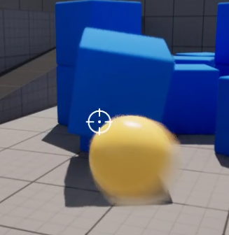
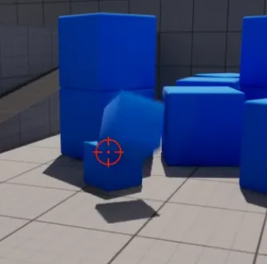

# 2024/12/20

主要解决问题：

- 准星制作

# Work01:关于准星的那些事儿

首先是制作两个准星的图片，用来表示击中和未击中时的准星表现：


左边为啥看不见因为左边是纯白的哈哈哈。实际样式如下：


准星widget类：主要是SetCrossTexture负责切换击中和未击中状态的纹理。

```cpp
// Fill out your copyright notice in the Description page of Project Settings.

#pragma once

#include "CoreMinimal.h"
#include "Blueprint/UserWidget.h"
#include "MyTargetWidget.generated.h"

class UImage;
/**
 * 
 */
UCLASS()
class FPS02_API UMyTargetWidget : public UUserWidget
{
	GENERATED_BODY()
	
public:
	UPROPERTY(EditAnywhere,BlueprintReadWrite,meta=(BindWidget))
	UImage* Target;
	UPROPERTY(BlueprintReadWrite)
	UTexture2D* TargetOnhit;
	UPROPERTY(BlueprintReadWrite)
	UTexture2D* TargetBase;
	UFUNCTION()
	void SetCrossTexture(UTexture2D* NewTexture);
	UFUNCTION()
	UTexture2D* LoadTexture(const FString& Path);
	virtual void NativeConstruct() override;
	UFUNCTION()
	void removeWidget();
};
```

当子弹触发OnHit函数时，我们向服务器发送命中请求，服务器处理其他数值计算的时候，调用ClientRPC让每个客户端自己更改准星状态，这里我设置了0.1s的计时器，即0.1s后准星恢复原始状态：

```cpp
//OnHit函数中，获取到PlayerController以后
MyPlayerController->ServerSetHitCrosshair();
GetWorld()->GetTimerManager().SetTimer(
    CrossHandle,
    [MyPlayerController]()
    {
        // Ensure the PlayerController is valid before resetting the crosshair
        if (MyPlayerController)
        {
            MyPlayerController->ServerSetBaseCrosshair();
        }
    },
    0.1f, // Delay time in seconds
    false // One-time timer, not looping
);
```

具体实现逻辑，和之前叙述无二：

```cpp
void Afps02PlayerController::ClientSetHitCrosshair_Implementation()
{
	SetHitCrosshair();
}

void Afps02PlayerController::ServerSetBaseCrosshair_Implementation()
{
	ClientSetBaseCrosshair();
}

void Afps02PlayerController::ServerSetHitCrosshair_Implementation()
{
	ClientSetHitCrosshair();
}

void Afps02PlayerController::ClientSetBaseCrosshair_Implementation()
{
	SetBaseCrosshair();
}

void Afps02PlayerController::SetHitCrosshair()
{
	if (TargetWidget && TargetWidget->TargetOnhit)
	{
		TargetWidget->SetCrossTexture(TargetWidget->TargetOnhit);
	}
}

void Afps02PlayerController::SetBaseCrosshair()
{
	if (TargetWidget && TargetWidget->TargetBase)
	{
		TargetWidget->SetCrossTexture(TargetWidget->TargetBase);
	}
}
```

效果：(红色好像压缩后看不太明显)


附两张图：



