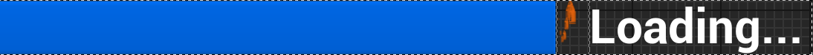
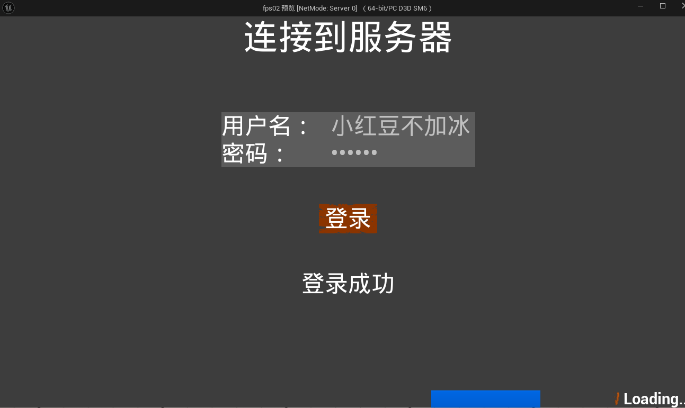
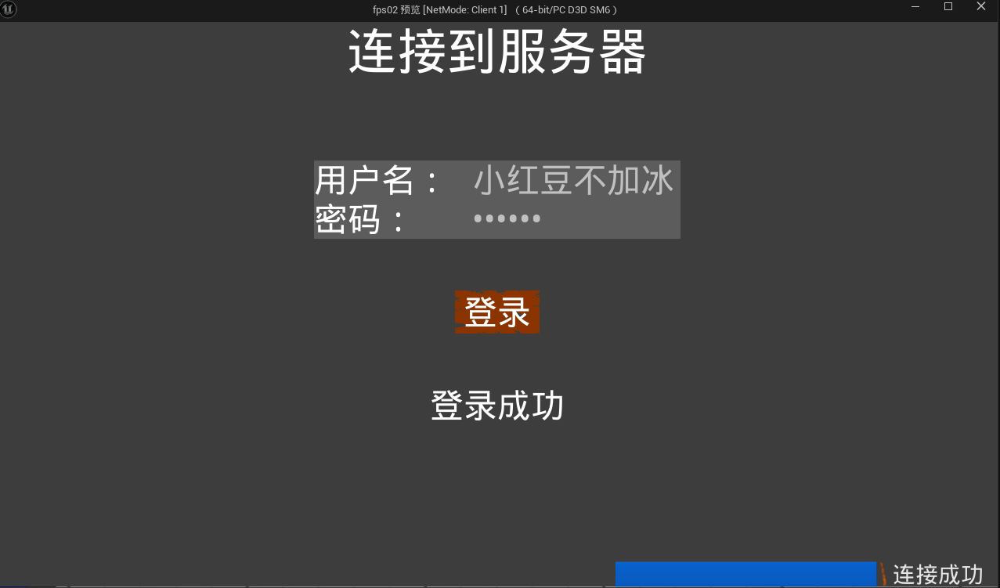

# 2024/12/23

主要解决问题：

- 加载界面UI动画

制作一个加载条放在登录界面的右下角（当然了，彼此拆分不关联）



两个动画，一个是加载动画，一个是淡出动画，类设计如下：

```cpp
class FPS02_API UMyPendingWidget : public UUserWidget
{
	GENERATED_BODY()
	
public:
	UPROPERTY(EditAnywhere,BlueprintReadWrite,meta=(BindWidget))
	UHorizontalBox* PendingBox;
	UPROPERTY(EditAnywhere,BlueprintReadWrite,meta=(BindWidget))
	UTextBlock* TipBlock;
	UPROPERTY(Transient,meta = (BindWidgetAnim))
	UWidgetAnimation* Loading;
	UPROPERTY(Transient,meta = (BindWidgetAnim))
	UWidgetAnimation* FadeOut;

	UFUNCTION(BlueprintCallable)
	void UpdateTipBlock(FString LogInfo);
	UFUNCTION(BlueprintCallable)
	void removeWidget();
};
```

登录成功以后，服务端在通知客户端登录结果的函数里增加如下逻辑：

1. 创建加载动画界面并播放动画；
2. 播放动画完成后销毁加载界面。

```cpp
//登录成功后
				if (!PlayerController->MyPendingWidget && PlayerController->MyPendingWidgetClass)
				{
					PlayerController->MyPendingWidget = CreateWidget<UMyPendingWidget>(
						PlayerController, PlayerController->MyPendingWidgetClass);
				}
				//播放连接的加载动画
				PlayerController->MyPendingWidget->AddToViewport();
				if (UWidgetAnimation* LoadingAnim = PlayerController->MyPendingWidget->Loading)
				{
					PlayerController->MyPendingWidget->PlayAnimation(LoadingAnim); // 播放动画
				}
				FTimerHandle Handle0;
				FTimerHandle Handle1;
				FTimerHandle Handle2;
				GetWorld()->GetTimerManager().SetTimer(Handle0, [this]()
				{
					if (UWidgetAnimation* FadeOutAnim = MyPendingWidget->FadeOut)
					{
						MyPendingWidget->UpdateTipBlock("连接成功");
						MyPendingWidget->PlayAnimation(FadeOutAnim); // 播放淡出动画
					}
				}, 4.0f, false);
				GetWorld()->GetTimerManager().SetTimer(Handle1, [this]()
				{
					MyPendingWidget->removeWidget();
					MyPendingWidget = nullptr;
					LogInWidget->removeWidget();
					LogInWidget=nullptr;
				}, 4.5f, false);
				GetWorld()->GetTimerManager().SetTimer(Handle2, [this]()
				{
					FInputModeGameOnly InputMode;
					SetInputMode(InputMode); // 设置为游戏输入模式
					bShowMouseCursor = false; // 隐藏鼠标光标
					GameIngWidget->SetVisibility(ESlateVisibility::Visible);
					if (UWidgetAnimation* FadeInAnim = GameIngWidget->FadeIn)
					{
						GameIngWidget->PlayAnimation(FadeInAnim); // 播放动画
					}
				}, 5.0f, false);
```





加载圈用的是自带的CircularThrobbder，把图像替换成了子弹纹理。