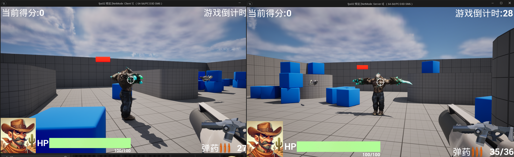

# 2024/12/24

需求分析：

1.实现敌人的基础移动动画蓝图，并尽可能优化表现。

2.实现敌人的死亡动画，并尽可能优化表现（如添加多方向死亡动画等）。

3.实现近战击败敌人的功能和动画表现。（选做）

---

针对需求2：使用不同的dead骨骼动画赋予敌人，在Sequencer中组合并建立不同的摄影机制作死亡动画，烘焙成动画序列，制作多种不同的死亡动画在敌人触发死亡时随机播放。

针对需求1：需要制作一个敌人AI，具有漫游，发现玩家+攻击的基础动画。

# Workd01：敌人类创建，附带血量显示

C++类设计：目前主要有当前血量，最大血量和攻击力三个设定

```cpp
// Fill out your copyright notice in the Description page of Project Settings.

#pragma once

#include "CoreMinimal.h"
#include "GameFramework/Character.h"
#include "MyEnemyCharacter.generated.h"

class UWidgetComponent;

UCLASS()
class FPS02_API AMyEnemyCharacter : public ACharacter
{
	GENERATED_BODY()

public:
	// Sets default values for this character's properties
	AMyEnemyCharacter();

protected:
	// Called when the game starts or when spawned
	virtual void BeginPlay() override;

public:	
	// Called every frame
	virtual void Tick(float DeltaTime) override;

	// Called to bind functionality to input
	virtual void SetupPlayerInputComponent(class UInputComponent* PlayerInputComponent) override;

	//敌人属性
	UPROPERTY(Replicated,EditAnywhere,BlueprintReadWrite,Category="Attributes")
	float BEnemyHealth;
	UPROPERTY(ReplicatedUsing="OnRep_HealthChange",EditAnywhere,BlueprintReadWrite,Category="Attributes")
	float BEnemyCurrentHealth;

	UPROPERTY(Replicated,EditAnywhere,BlueprintReadWrite,Category="Attributes")
	float BEnemyAttack;
	UPROPERTY(EditAnywhere,BlueprintReadWrite, Category = "UI")
	UWidgetComponent* HealthWidgetComponent;
	UPROPERTY(EditAnywhere,BlueprintReadWrite,Category="UI")
	TSubclassOf<UUserWidget> EnemyHUDWidgetClass;

	
	[[nodiscard]] float GetBEnemyCurrentHealth() const
	{
		return BEnemyCurrentHealth;
	}

	void SetBEnemyCurrentHealth(float EnemyCurrentHealth)
	{
		this->BEnemyCurrentHealth = EnemyCurrentHealth;
	}

	[[nodiscard]] float GetBEnemyHealth() const
	{
		return BEnemyHealth;
	}

	void SetBEnemyHealth(float EnemyHealth)
	{
		this->BEnemyHealth = EnemyHealth;
	}

	[[nodiscard]] float GetBEnemyAttack() const
	{
		return BEnemyAttack;
	}

	void SetBEnemyAttack(float EnemyAttack)
	{
		this->BEnemyAttack = EnemyAttack;
	}

	
	//更新怪物血条
	UFUNCTION(Server, Reliable)
	void ServerUpdateEnemyHUD();
	UFUNCTION(NetMulticast, Reliable)
	void MultiCastUpdateEnemyHUD();
	void UpdateEnemyHUD();
	//怪物死亡销毁
	void DestroyEnemy();
	//血量变化响应函数
	UFUNCTION()
	void OnRep_HealthChange();
};

```

完善设计逻辑，当命中怪物时，根据武器的攻击力更新怪物血量，更新怪物血量UI（更新ProgressBar的百分比）。

```cpp
//子弹的Onhit函数
//…………
if (OtherActor->IsA(AMyEnemyCharacter::StaticClass()))
			{
				TObjectPtr<AMyEnemyCharacter> MyEnemy = Cast<AMyEnemyCharacter>(OtherActor);
				if (MyEnemy)
				{
					TObjectPtr<Afps02Character> MyPawn = Cast<Afps02Character>(GetOwner());
					if ( MyPawn->HasAuthority())
					{
						if (MyEnemy->GetBEnemyCurrentHealth() > 0)
						{
							MyEnemy->SetBEnemyCurrentHealth(
								MyEnemy->GetBEnemyCurrentHealth() - MyPawn->GetBPlayerAttack());
							//UE_LOG(LogTemp, Warning, TEXT("Enemy Hit! Current Health: %f"),MyEnemy->GetBEnemyCurrentHealth());
							MyEnemy->OnRep_HealthChange();
						}
					}
				}
			}
//…………			
			
//更新函数
void AMyEnemyCharacter::UpdateEnemyHUD()
{
	if (HealthWidgetComponent)
	{
		if (HealthWidgetComponent->GetUserWidgetObject())
		{
			if (TObjectPtr<UMyEnemyHUDWidget> EnemyHUDWidget = Cast<UMyEnemyHUDWidget>(
				HealthWidgetComponent->GetUserWidgetObject()))
			{
				float HealthPercent=BEnemyCurrentHealth/BEnemyHealth;
				if(EnemyHUDWidget->BHealthProgressBar)
				{
					EnemyHUDWidget->BHealthProgressBar->SetPercent(HealthPercent);
				}
			}
		}
	}
}
```

这里在tick函数里做一下旋转，让血条UI组件一直面对玩家：

```cpp
void AMyEnemyCharacter::Tick(float DeltaTime)
{
	Super::Tick(DeltaTime);
	TObjectPtr<Afps02PlayerController> PlayerController =Cast<Afps02PlayerController>(GetWorld()->GetFirstPlayerController()) ;
	if (PlayerController)
	{
		FVector CameraLocation;
		FRotator CameraRotation;
		PlayerController->GetPlayerViewPoint(CameraLocation, CameraRotation);

		// 更新血条的朝向
		if (HealthWidgetComponent)
		{
			FVector DirectionToCamera = CameraLocation - HealthWidgetComponent->GetComponentLocation();
			FRotator NewRotation = DirectionToCamera.Rotation();
			HealthWidgetComponent->SetWorldRotation(NewRotation);
		}
	}
}
```

