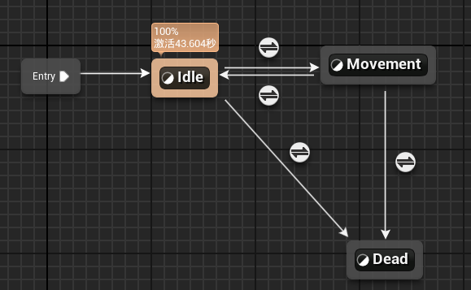
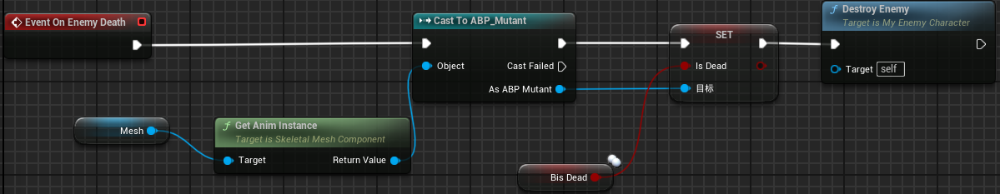
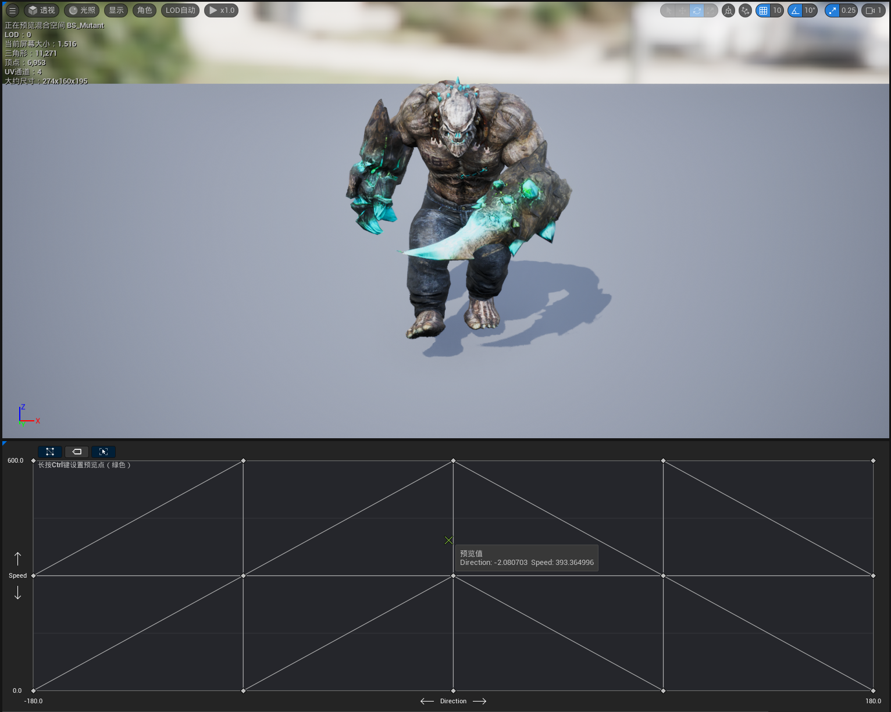
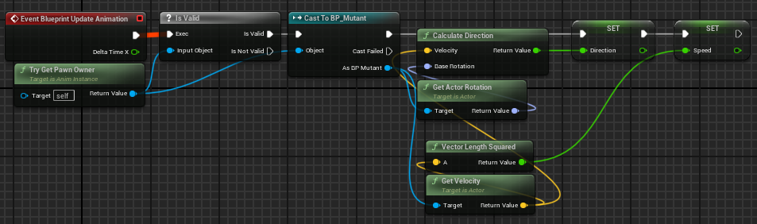
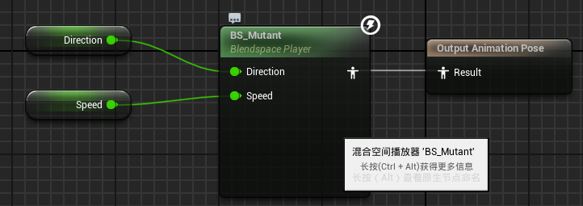

# 2024/12/25

主要解决问题：

- 怪物动画蓝图编辑

# Work01：怪物死亡动画

在怪物属性里添加isDead标志用来标记怪物是否被击毙。

然后制作一个基础的动画蓝图：



在动画蓝图里添加isDead标记用来实现Dead状态的转换。

在之前的处理血量变化响应函数里完善一下逻辑：

```cpp

void AMyEnemyCharacter::OnRep_HealthChange()
{
	if (BEnemyCurrentHealth <= 0)
	{
		if (!BisDead)
		{
			HanldeDeath();
		}
	}

	MultiCastUpdateEnemyHUD();
}
//使用广播机制在所有端同步死亡
void AMyEnemyCharacter::HanldeDeath()
{
	if (HasAuthority())
	{
		MultiCastHandleDeath();
	}
}

void AMyEnemyCharacter::MultiCastHandleDeath_Implementation()
{
	if (!BisDead)
	{
		UCapsuleComponent* Capsule = GetCapsuleComponent();
		if (Capsule)
		{
			Capsule->SetCollisionEnabled(ECollisionEnabled::NoCollision);
			GetCharacterMovement()->StopMovementImmediately();
			GetCharacterMovement()->SetComponentTickEnabled(false);
		}
		SetBisDead(true);
		OnEnemyDeath();
	}
}

```

这里首先取消怪物的碰撞，将死亡标记置为true。设计了一个蓝图实现的自定义事件OnEnemyDeath();




# Work02:怪物移动蓝图

首先编辑怪物移动的混合空间：



速度在0-600之间有Idle，Walk和Run两种动画，这里倒是没用上Direction。

在动画蓝图里进行变量设置：



在之前的状态机里：站立到行走的状态转换条件是Speed是否>10.Movement状态里就根据Speed选择之前混合空间的动画。

