# 2024/12/27

主要解决问题：

- 多方向死亡动画

# Work01:多方向死亡动画

导入基础死亡动画-前后左右。

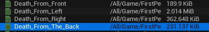

分别模拟从前后左右方向中弹的表现。

控制方式：设立一个Vector4 变量DeadDirection，每个维度表示四个方向的占比。

在死亡状态里：将四个动画以前后左右的权重融合在一起。

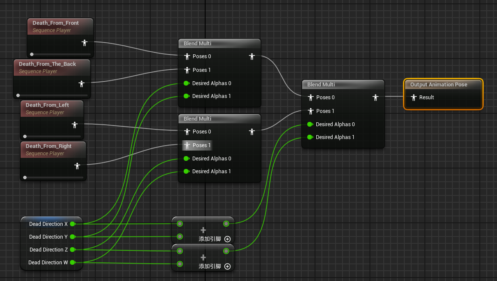

问题来了，如何计算/确定每个维度的权重？

补充敌人角色蓝图，添加击杀者：

```cpp
	UPROPERTY(Replicated,VisibleAnywhere,BlueprintReadOnly,Category="Attributes")
	AActor* BKiller;
```

完善死亡处理函数：使之记录该AI敌人的击杀者，这里我需要角色的位置信息，因此选择传入Character。

```cpp
void AMyEnemyCharacter::HandleDeath(AActor* Killer)
{
	if (HasAuthority())
	{
		Afps02PlayerController* PlayerController = Cast<Afps02PlayerController>(Killer);
		BKiller=PlayerController->GetCharacter();
		//UE_LOG(LogTemp, Warning, TEXT("Killer: %s"),*BKiller->GetName());
		MultiCastHandleDeath();
	}
}
```

当然了，在蓝图里也要把杀手传给动画蓝图。在动画蓝图里，紧接着死亡布尔值设定后面，来处理四个方向的计算和判定。

关键点：使用点积判断前后，使用叉积判断左右。

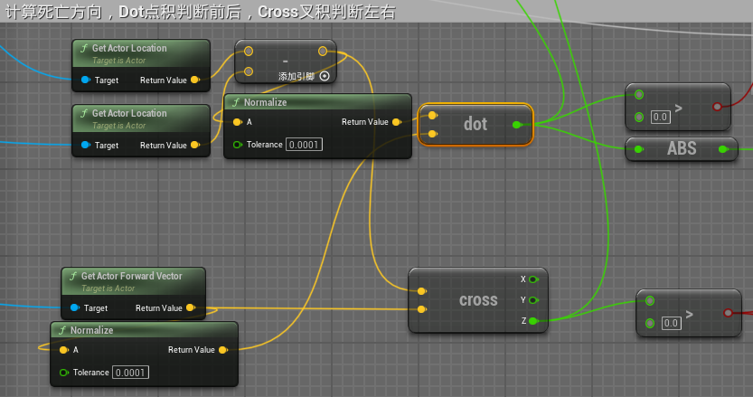

上面是杀手的角色Pawn，下面是敌人角色Pawn。用Location相减得到怪物指向玩家的向量，再和怪物的Forward向量进行Dot计算，如果结果大于0则玩家处于怪物的前方，反之处在后方；进行Cros叉积计算，如果结果大于0则玩家处在怪物的左手边，反之处在右手边。

根据三角函数余弦值的分布，这里简单地设定：

- 45°-135°范围内”From_Front“死亡动画占据主导地位
- 225°-315°范围内”From_Back“死亡动画占据主导地位
- 0°-45°与315°-360°范围内”From_Right“死亡动画占据主导地位
- 135°-225°范围内”From_Left“死亡动画占据主导地位

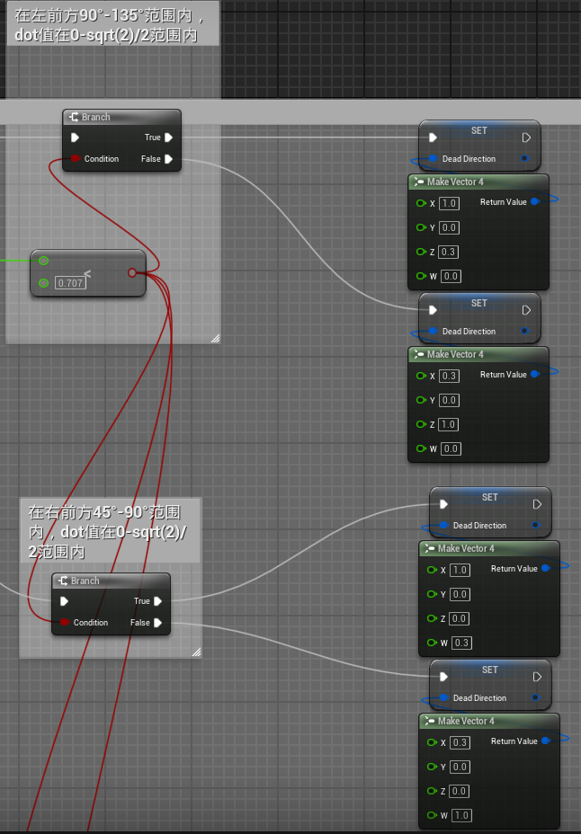

部分蓝图逻辑如上图所示。

这样就可以在四周任意方向受击死亡时进行动画的融合与切换。

效果展示：

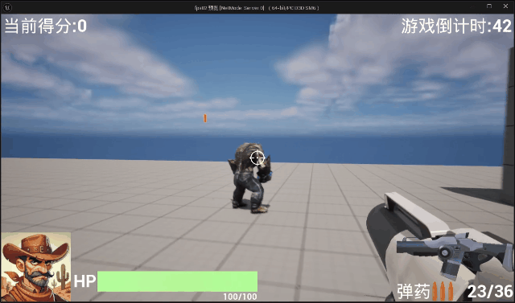


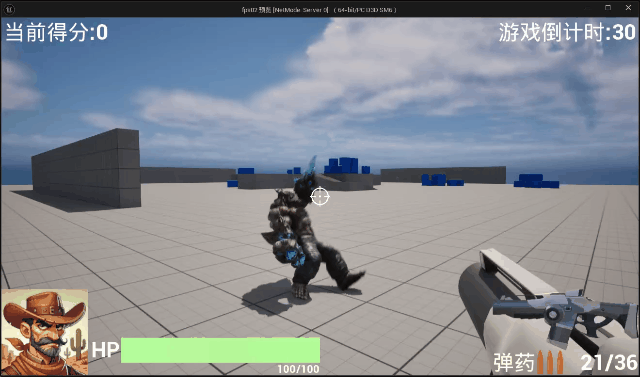

# Work02:怪物攻击动画

关于非In Place动画的解决方案：

1. 在动画的骨骼树里启用根运动；
2. 将骨骼导入Blender

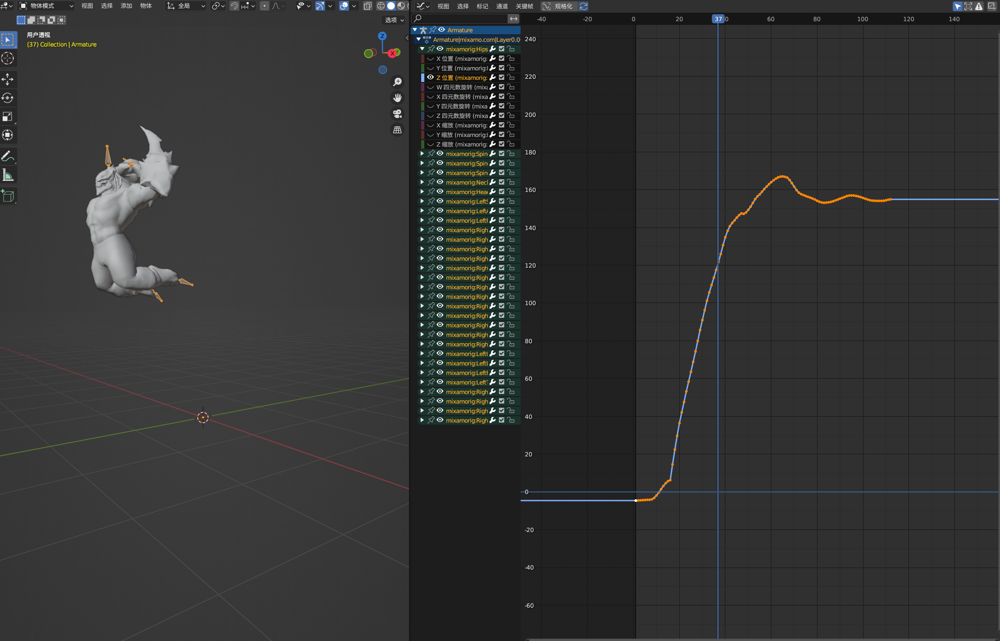

在曲线编辑器中可以发现，是Z位置上发生了位移导致动画不在原地，把这些关键帧全部调整为0再导出即可。

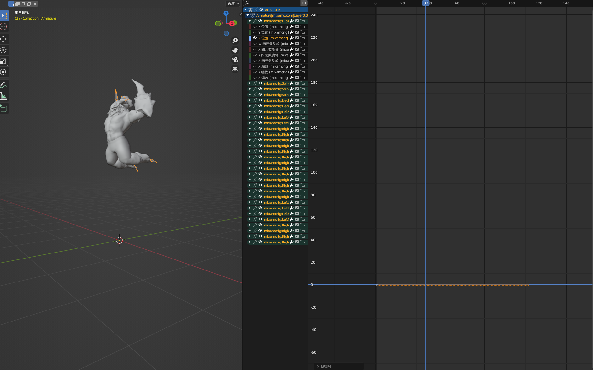

导出设置里：UE默认是X向前，Z向上，因此需要设置一下：

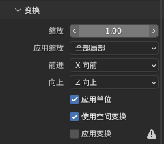

骨架里需要去除“添加叶骨”以免Blender为我们添加额外的骨骼***_end。

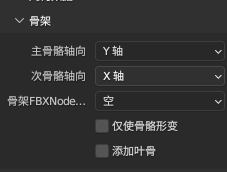

使用了三个攻击动画，使用变量AttackWay用于控制攻击动画蒙太奇播放，使用事件分发器控制攻击事件生命周期

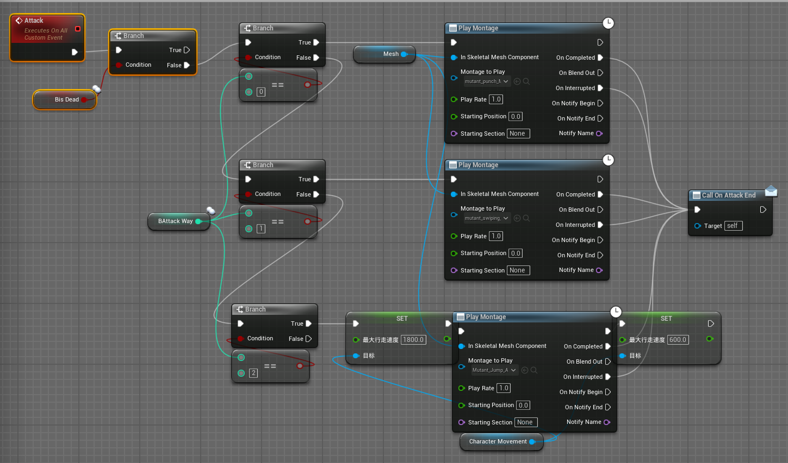

当玩家距离怪物比较远的时候，怪物只会自己巡逻，当玩家进入攻击圈以后，怪物会随机挑选一种攻击方式攻击。

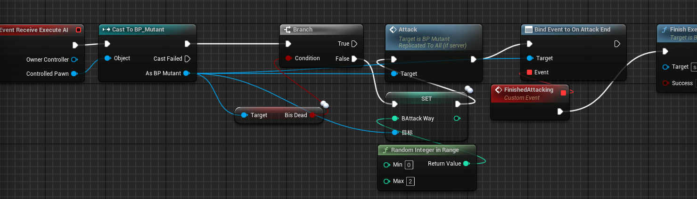

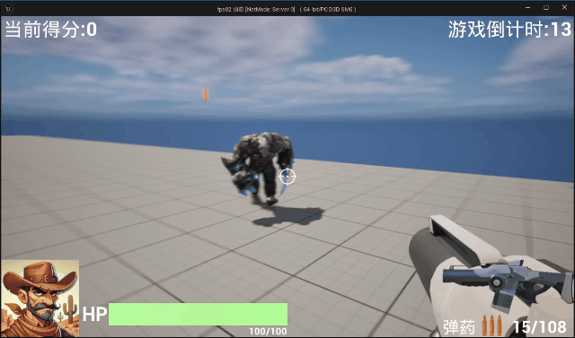


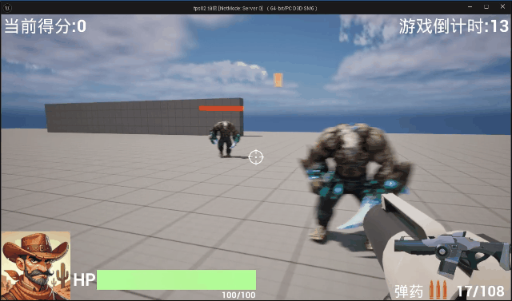