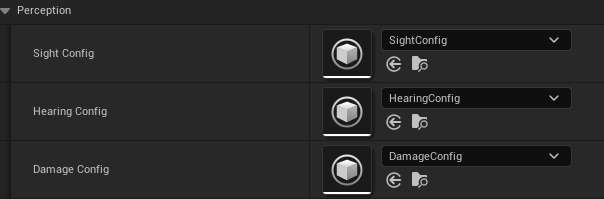

# 2025/1/6

主要解决问题：

- 自定义AIController设计

# Work01:AIController设计与感知组件装配

编写一个新的AI控制器类：

```cpp
// Fill out your copyright notice in the Description page of Project Settings.

#pragma once

#include "CoreMinimal.h"
#include "AIController.h"
#include "BehaviorTree/BehaviorTree.h"
#include "BehaviorTree/BehaviorTreeComponent.h"
#include "BehaviorTree/BlackboardComponent.h"
#include "Net/UnrealNetwork.h"
#include "Perception/AISenseConfig_Sight.h"
#include "Perception/AIPerceptionComponent.h"
#include "Perception/AISenseConfig_Hearing.h"
#include "Perception/AISenseConfig_Damage.h"
#include "MyEnemyAIController.generated.h"

/**
 * 
 */
UCLASS()
class FPS02_API AMyEnemyAIController : public AAIController
{
	GENERATED_BODY()
public:
	AMyEnemyAIController();
	virtual void BeginPlay() override;
	virtual void OnPossess(APawn* InPawn) override;
	//行为树
	UPROPERTY(EditAnywhere, BlueprintReadWrite, Category = "AI")
	UBehaviorTree* BMyBehaviorTree;
  //黑板
	UPROPERTY(EditAnywhere, BlueprintReadWrite, Category = "AI")
	UBlackboardData* BlackboardAsset;
	// 视觉感知配置
	UPROPERTY(EditAnywhere, BlueprintReadWrite, Category = "AI|Perception")
	UAISenseConfig_Sight* SightConfig;
	//听觉感知配置
	UPROPERTY(EditAnywhere, BlueprintReadWrite, Category = "AI|Perception")
	UAISenseConfig_Hearing* HearingConfig;
	//伤害感知配置
	UPROPERTY(EditAnywhere, BlueprintReadWrite, Category = "AI|Perception")
	UAISenseConfig_Damage* DamageConfig;
};

```

构造函数里配置三个感知配件：

```cpp
AMyEnemyAIController::AMyEnemyAIController()
{
	PerceptionComponent = CreateDefaultSubobject<UAIPerceptionComponent>(TEXT("PerceptionComponent"));
	SightConfig = CreateDefaultSubobject<UAISenseConfig_Sight>(TEXT("SightConfig"));
	HearingConfig = CreateDefaultSubobject<UAISenseConfig_Hearing>(TEXT("HearingConfig"));
	DamageConfig=CreateDefaultSubobject<UAISenseConfig_Damage>(TEXT("DamageConfig"));
	if (SightConfig)
	{
		SightConfig->SightRadius = 1000.0f;             // 感知范围
		SightConfig->LoseSightRadius = 1200.0f;         // 失去感知的范围
		SightConfig->PeripheralVisionAngleDegrees = 60.0f; // 视野角度
		SightConfig->SetMaxAge(5.0f);                  // 感知信息的最大存储时间

		SightConfig->DetectionByAffiliation.bDetectEnemies = true;
		SightConfig->DetectionByAffiliation.bDetectNeutrals = true;
		SightConfig->DetectionByAffiliation.bDetectFriendlies = true;

		PerceptionComponent->ConfigureSense(*SightConfig);
		PerceptionComponent->SetDominantSense(SightConfig->GetSenseImplementation());
	}
	if(HearingConfig)
	{
		HearingConfig->HearingRange = 500.0f;  // 听觉感知范围
		HearingConfig->SetMaxAge(3.0f);  // 最大存储时间
		HearingConfig->DetectionByAffiliation.bDetectEnemies=true;
		HearingConfig->DetectionByAffiliation.bDetectFriendlies=false;
		HearingConfig->DetectionByAffiliation.bDetectNeutrals=true;
		
		PerceptionComponent->ConfigureSense(*HearingConfig);
	}
	if(DamageConfig)
	{
		DamageConfig->SetMaxAge(5.0f); // 最大存储时间

		if (PerceptionComponent)
		{
			PerceptionComponent->ConfigureSense(*DamageConfig);
		}
	}

}
```

听觉和伤害事件需要主动产生：

听觉感知函数

```cpp
static void UAISense_Hearing::ReportNoiseEvent(
const UObject* WorldContextObject, // 世界上下文
FVector NoiseLocation,             // 噪音位置
float Loudness,                    // 噪音的音量
AActor* Instigator,                // 产生噪音的角色（通常是攻击者）
float MaxRange = 0.0f,             // 最大感知范围（可选，0 表示不限范围）
FName Tag = NAME_None              // 噪音事件的标签（可选，用于区分噪音种类）
);
```

伤害感知函数

```cpp
static void UAISense_Damage::ReportDamageEvent(
UWorld* WorldContextObject,      // 世界上下文
AActor* DamagedActor,            // 受到伤害的对象
AActor* Instigator,              // 造成伤害的对象（攻击者）
float DamageAmount,              // 伤害量
const FVector& EventLocation,    // 事件发生位置（受伤位置）
const FVector& HitLocation ,     // 伤害方向（可选，默认为零向量）
FName Tag = NAME_None            //伤害事件标签
);
```

注意在上海感知函数里EventLocation虽然表面上是受伤事件发生的位置，理应是Enemy角色的位置，但是实际Debug时发现其实这里应该传入的是攻击者即伤害来源的位置。
在之前的代码中，伤害处理是怪物角色自己负责的，因此我们在原来处理血量变化的程序位置添加伤害事件感知函数：

```cpp
void AMyEnemyCharacter::OnReceiveDamage(float DamageAmout, AActor* DamageCauser)
{
	Afps02Character* Character = Cast<Afps02Character>(DamageCauser);
	if (Character)
	{
		FVector SourceLocation = Character->GetActorLocation();
		FVector SelfLocation = GetActorLocation();
		FVector HitFlatDirection = FVector(SourceLocation.X - SelfLocation.X, SourceLocation.Y - SelfLocation.Y, 0.0f);
		FVector DamageDirectionXZ = HitFlatDirection.GetSafeNormal();
		UAISense_Damage::ReportDamageEvent(
			GetWorld(),
			this,
			Character,
			DamageAmout,
			SourceLocation,
			DamageDirectionXZ
		);
	}
}
//在发射物与怪物角色接触时：
//…………
float CurrentHealth = MyEnemy->GetBEnemyCurrentHealth() - MyPawn->GetBPlayerAttack();
MyEnemy->SetBEnemyCurrentHealth(FMath::Clamp(CurrentHealth, 0.0f, CurrentHealth));
MyEnemy->OnRep_HealthChange();
MyEnemy->OnReceiveDamage(MyPawn->GetBPlayerAttack(), this->GetOwner());
//…………
```

听觉感知事件放在开火的地方，原组件有播放音效，正好可以写在这里：

```cpp
//Fire函数
//…………
if (FireSound != nullptr)
{
UGameplayStatics::PlaySoundAtLocation(this, FireSound, Character->GetActorLocation());
MakeFireNoise(Character, Character->GetActorLocation(), BLoudness);
}
//…………
```

```cpp
void UTP_WeaponComponent::MakeFireNoise(AActor* Owner, FVector ActorLocation, float Loudness)
{
	Afps02Character* ShotCharacter = Cast<Afps02Character>(Owner);
	if (ShotCharacter)
	{
		UAISense_Hearing::ReportNoiseEvent(
			GetWorld(),
			ActorLocation,
			Loudness,
			ShotCharacter,
			0.0f, FName("GunShotNoise"));
		//UE_LOG(LogTemp, Log, TEXT("Noise event generated at location: %s, Loudness: %f"), *ActorLocation.ToString(), Loudness);
	}
}
```



注意：`CreateDefaultSubobject` 动态创建的组件不会直接暴露在蓝图编辑器中。
添加响应函数：

```cpp
//定义
UFUNCTION(BlueprintCallable,BlueprintImplementableEvent,Category="AI|Perception")
void OnPerceptionTargetUpdated(const TArray<AActor*>& UpdatedActors);

//构造函数中
BPerceptionComponent->OnPerceptionUpdated.AddDynamic(this, &AMyEnemyAIController::OnPerceptionTargetUpdated);
```

# Work02：感知事件

主要是视觉，听觉和受击三个感知事件，设计一个枚举类型：

```cpp
UENUM(BlueprintType)
enum class EAISense : uint8
{
	None UMETA(DisplayName = "None"),
	Sight UMETA(DisplayName = "Sight"),
	Hearing UMETA(DisplayName = "Hearing"),
	Damage UMETA(DisplayName = "Damage")
};
```

响应函数完善”测试能否被感知：这里注意需要在怪物本身是活着的情况才能感知，因此需要获取属性判断isDead,使用GetPawn而不是GetOwner（获取到的是PlayerController）。

```cpp
UFUNCTION(BlueprintCallable, Category="AI|Perception")
void OnPerceptionTargetUpdated(const TArray<AActor*>& UpdatedActors);

//cpp
	TObjectPtr<AMyEnemyCharacter> MyEnemyCharacter = Cast<AMyEnemyCharacter>(GetPawn());
	if (MyEnemyCharacter && !MyEnemyCharacter->IsDead())
	{
		//没有死亡才可以感知
		for (AActor* Actor : UpdatedActors)
		{
			TObjectPtr<Afps02Character> Target = Cast<Afps02Character>(Actor);
			if (EnemyCanSenseActor(Actor, EAISense::Sight))
			{
				if (Target)
				{
					UE_LOG(LogTemp, Warning, TEXT("感知对象：%s，感知方式:视觉"), *Target->GetName());
				}
			}
			if (EnemyCanSenseActor(Actor, EAISense::Hearing))
			{
				if (Target)
				{
					UE_LOG(LogTemp, Warning, TEXT("感知对象：%s，感知方式:听觉"), *Target->GetName());
				}
			}
			if (EnemyCanSenseActor(Actor, EAISense::Damage))
			{
				if (Target)
				{
					UE_LOG(LogTemp, Warning, TEXT("感知对象：%s，感知方式:受击"), *Target->GetName());
				}
			}
		}
	}
```

敌人感知到角色的方法：利用FAIStimulus判断感知情况

```cpp
EAISense AMyEnemyAIController::GetSenseTypeFromStimulus(FAIStimulus& Stimulus)
{
	TSubclassOf<UAISense> SenseClass = UAIPerceptionSystem::GetSenseClassForStimulus(GetWorld(), Stimulus);
	if (SenseClass == UAISense_Sight::StaticClass())
	{
		return EAISense::Sight;
	}
	else if (SenseClass == UAISense_Hearing::StaticClass())
	{
		return EAISense::Hearing;
	}
	else if (SenseClass == UAISense_Damage::StaticClass())
	{
		return EAISense::Damage;
	}

	return EAISense::None;
}

bool AMyEnemyAIController::EnemyCanSenseActor(AActor* Target, EAISense CurrentPerception)
{
	if (GetPerceptionComponent())
	{
		FActorPerceptionBlueprintInfo ActorPerceptionBlueprintInfo;
		GetPerceptionComponent()->GetActorsPerception(Target, ActorPerceptionBlueprintInfo);
		for (FAIStimulus& Stimulus : ActorPerceptionBlueprintInfo.LastSensedStimuli)
		{
			EAISense SenseType = GetSenseTypeFromStimulus(Stimulus);
			if (CurrentPerception == SenseType)
			{
				UEnum* EnumPtr = StaticEnum<EAISense>();
				return Stimulus.WasSuccessfullySensed();
			}
		}
	}
	return false;
}
```

上面的视觉触发事件需要考虑联网情况，客户端自己不能make Noise，使用一个Server RPC即可：

```cpp
//噪音感知生成
	UFUNCTION(BlueprintCallable, Category="Weapon")
	void MakeFireNoise(AActor* Player, FVector ActorLocation, float Loudness);
	UFUNCTION(Server, Unreliable)
	void ServerMakeFireNoise(AActor* Player, FVector ActorLocation, float Loudness);
//cpp
void UTP_WeaponComponent::ServerMakeFireNoise_Implementation(AActor* Player, FVector ActorLocation, float Loudness)
{
	MakeFireNoise(Player, ActorLocation, BLoudness);
}
```

一些输出日志如下：

```cpp
LogTemp: Generating noise at location: X=-1002.217 Y=2833.668 Z=98.150 with Loudness: 10.000000
LogTemp: Warning: 感知对象：BP_FirstPersonCharacter_C_0，感知方式:听觉
LogTemp: Warning: 感知对象：BP_FirstPersonCharacter_C_0，感知方式:听觉
LogTemp: Generating noise at location: X=-1027.031 Y=2811.735 Z=98.150 with Loudness: 10.000000
LogTemp: Warning: 感知对象：BP_FirstPersonCharacter_C_0，感知方式:听觉
LogTemp: Warning: 感知对象：BP_FirstPersonCharacter_C_0，感知方式:听觉
LogTemp: Generating noise at location: X=-1027.031 Y=2811.735 Z=98.150 with Loudness: 10.000000
LogTemp: Warning: 感知对象：BP_FirstPersonCharacter_C_0，感知方式:听觉
LogTemp: Warning: 感知对象：BP_FirstPersonCharacter_C_0，感知方式:听觉
LogTemp: Generating noise at location: X=-1027.031 Y=2811.735 Z=98.150 with Loudness: 10.000000
LogTemp: Warning: 感知对象：BP_FirstPersonCharacter_C_0，感知方式:听觉
LogTemp: Warning: 感知对象：BP_FirstPersonCharacter_C_0，感知方式:听觉
LogTemp: Generating noise at location: X=-1027.031 Y=2811.735 Z=98.150 with Loudness: 10.000000
LogTemp: Warning: 感知对象：BP_FirstPersonCharacter_C_0，感知方式:听觉
LogTemp: Warning: 感知对象：BP_FirstPersonCharacter_C_0，感知方式:听觉
LogTemp: Player's name from DESKTOP-5BTRM8V-3697 updated to: 小红豆不加冰
LogTemp: Generating noise at location: X=-876.809 Y=2862.448 Z=98.100 with Loudness: 10.000000
LogTemp: Warning: 感知对象：BP_FirstPersonCharacter_C_1，感知方式:听觉
LogTemp: Warning: 感知对象：BP_FirstPersonCharacter_C_1，感知方式:听觉
LogTemp: Warning: 感知对象：BP_FirstPersonCharacter_C_1，感知方式:听觉
LogTemp: Warning: 感知对象：BP_FirstPersonCharacter_C_1，感知方式:受击
LogTemp: Generating noise at location: X=-876.809 Y=2862.448 Z=98.100 with Loudness: 10.000000
LogTemp: Warning: 感知对象：BP_FirstPersonCharacter_C_1，感知方式:听觉
LogTemp: Warning: 感知对象：BP_FirstPersonCharacter_C_1，感知方式:受击
LogTemp: Warning: 感知对象：BP_FirstPersonCharacter_C_1，感知方式:听觉
LogTemp: Warning: 感知对象：BP_FirstPersonCharacter_C_1，感知方式:听觉
LogTemp: Warning: 感知对象：BP_FirstPersonCharacter_C_1，感知方式:受击
LogTemp: Generating noise at location: X=-876.809 Y=2862.448 Z=98.100 with Loudness: 10.000000
LogTemp: Warning: 感知对象：BP_FirstPersonCharacter_C_1，感知方式:听觉
LogTemp: Warning: 感知对象：BP_FirstPersonCharacter_C_1，感知方式:受击
LogTemp: Warning: 感知对象：BP_FirstPersonCharacter_C_1，感知方式:听觉
LogTemp: Warning: 感知对象：BP_FirstPersonCharacter_C_1，感知方式:听觉
LogTemp: Warning: 感知对象：BP_FirstPersonCharacter_C_1，感知方式:受击
```

可以正常感知了。