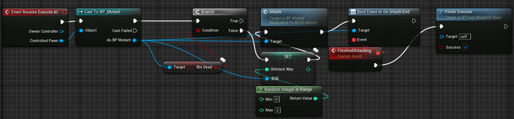

# 2025/1/11

主要解决问题：

- 基于行为树和黑板的AI敌人逻辑设计

# Work01：行为树行为1：随机巡逻

初始设计：以敌人和玩家的距离侦测玩家是否出现在攻击范围内：


需要计算被攻击方到怪物的距离，这里ClearFocus是为了防止动画扭曲。


新设计：有了感知系统以后，就不需要手动计算了。

我们将怪物角色的状态列举出来：暂时先讨论被动状态和攻击状态。

```cpp
enum class EAILocalStates : uint8
{
	Passive UMETA(DisplayName = "Passive"),
	Attacking UMETA(DisplayName = "Attacking"),
	Dead UMETA(DisplayName = "Dead"),
	Frozen UMETA(DisplayName = "Frozen"),
	Investigating UMETA(DisplayName = "Investigating"),
	Resting UMETA(DisplayName = "Resting")
};
```

这样，就有两个任务分叉：


当然了，需要在黑板中定义状态这个“知识点”：


接下来主要思想：让怪物角色随机取300-600间的速度移动到周身1米内的随机位置，进行巡逻任务。


# Work02：行为树行为2：攻击玩家

定义黑板知识点：AttackTarget——攻击角色。




主要思想：在动画那节有提到过随机选择攻击方式。通过事件委托回调判断当前攻击是否已结束，确保蒙太奇动画完整播放。

整个攻击流程如下：


装备上攻击时的行进速度，移动到玩家位置，聚焦在玩家身上进行攻击。

# Work03：状态切换

接下来是切换到别的状态，函数定义：

```cpp
	//状态转换黑板键名称
	UPROPERTY(EditAnywhere,BlueprintReadWrite,Category="AI|StateTransfer")
	FName BStateKeyName=FName("State");
	UPROPERTY(EditAnywhere,BlueprintReadWrite,Category="AI|StateTransfer")
	FName BAttackTargetName=FName("AttackTarget");
	
	//被动巡逻状态
	UFUNCTION(BlueprintCallable,Category="AI|StateTransfer")
	void SetStateAsPassive();
	//攻击状态
	UFUNCTION(BlueprintCallable,Category="AI|StateTransfer")
	void SetStateAsAttacking(AActor* Target);
	//看见玩家后如何反应
	UFUNCTION(BlueprintCallable,Category="AI|Behaviour")
	void HnadleSensedSight(AActor* Target);
	//获取当前状态
	UFUNCTION(BlueprintCallable,Category="AI|StateTransfer")
	EAILocalStates GetCurrentState();
```

具体实现：

```cpp
void AMyEnemyAIController::SetStateAsPassive()
{
	if (UBlackboardComponent* MyblBlackboardComponent = GetBlackboardComponent())
	{
		MyblBlackboardComponent->SetValueAsEnum(BStateKeyName, static_cast<uint8>(EAILocalStates::Passive));
	}
}

void AMyEnemyAIController::SetStateAsAttacking(AActor* Target)
{
	if (UBlackboardComponent* MyblBlackboardComponent = GetBlackboardComponent())
	{
		MyblBlackboardComponent->SetValueAsEnum(BStateKeyName, static_cast<uint8>(EAILocalStates::Attacking));
		MyblBlackboardComponent->SetValueAsObject(BAttackTargetName, Target);
	}
}

void AMyEnemyAIController::HnadleSensedSight(AActor* Target)
{
	
	EAILocalStates State = GetCurrentState();
	if (State == EAILocalStates::Passive || State == EAILocalStates::Investigating)
	{
		SetStateAsAttacking(Target);
	}
}

EAILocalStates AMyEnemyAIController::GetCurrentState()
{
	if (UBlackboardComponent* MyblBlackboardComponent = GetBlackboardComponent())
	{
		return static_cast<EAILocalStates>(MyblBlackboardComponent->GetValueAsEnum(GetStateKeyName()));
	}
}
```

初始的时候怪物处于被动状态（只会巡逻）


如果看到玩家或受到攻击则进入攻击状态

```cpp
			if (EnemyCanSenseActor(Actor, EAISense::Sight))
			{
				if (Target)
				{
					HnadleSensedSight(Actor);
					UE_LOG(LogTemp, Warning, TEXT("感知对象：%s，感知方式:视觉"), *Target->GetName());
				}
			}

```

```cpp
			if (EnemyCanSenseActor(Actor, EAISense::Damage))
			{
				if (Target)
				{
					HnadleSensedSight(Actor);
					UE_LOG(LogTemp, Warning, TEXT("感知对象：%s，感知方式:受击"), *Target->GetName());
				}
			}
```