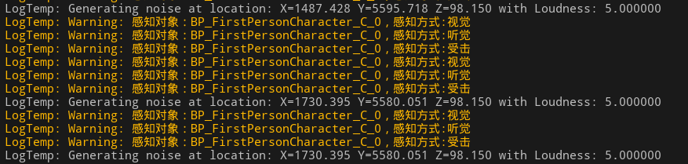
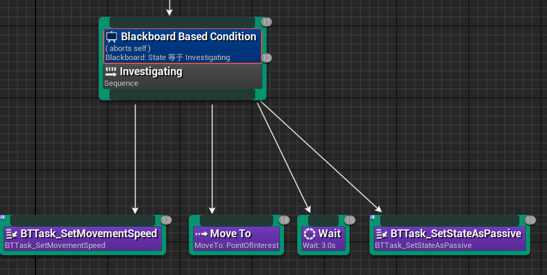

# 2025/1/17

主要解决问题：

- 基于行为树和黑板的AI敌人逻辑设计

# Work01：完善状态设计

```cpp
UENUM(BlueprintType)
enum class EAISense : uint8
{
	None UMETA(DisplayName = "None"),
	Sight UMETA(DisplayName = "Sight"),
	Hearing UMETA(DisplayName = "Hearing"),
	Damage UMETA(DisplayName = "Damage")
};
UENUM(BlueprintType)
enum class EAILocalStates : uint8
{
	Passive UMETA(DisplayName = "Passive"),
	Attacking UMETA(DisplayName = "Attacking"),
	Dead UMETA(DisplayName = "Dead"),
	Frozen UMETA(DisplayName = "Frozen"),
	Investigating UMETA(DisplayName = "Investigating"),
	Resting UMETA(DisplayName = "Resting")
};
UENUM(BlueprintType)
enum class EMovementSpeed : uint8
{
	Idle UMETA(DisplayName = "Idle"),
	Walking UMETA(DisplayName = "Walking"),
	Jogging UMETA(DisplayName = "Jogging"),
	Sprinting UMETA(DisplayName = "Sprinting")
};
USTRUCT(Blueprintable)
struct FPerceptionResult
{
	GENERATED_BODY()
	UPROPERTY(BlueprintReadOnly)
	bool bSensed;

	UPROPERTY(BlueprintReadOnly)
	FAIStimulus Stimulus;

	FPerceptionResult() : bSensed(false), Stimulus() {}
};
```

添加了基础状态、移动状态和感知结果。

除了巡逻和攻击状态，现在怪物会对玩家发出的声音进行侦察（Investigate），在黑板中添加新的知识键：


```cpp

void AMyEnemyAIController::SetStateAsInvestigating(FVector Location)
{
	if (UBlackboardComponent* MyblBlackboardComponent = GetBlackboardComponent())
	{
		MyblBlackboardComponent->SetValueAsEnum(BStateKeyName, static_cast<uint8>(EAILocalStates::Investigating));
		MyblBlackboardComponent->SetValueAsVector(BInvestigatingName, Location);
	}
}
void AMyEnemyAIController::HandleSensedHearing(FVector Location)
{
	EAILocalStates State = GetCurrentState();
	if (State == EAILocalStates::Passive || State == EAILocalStates::Investigating)
	{
		SetStateAsInvestigating(Location);
	}
}
```

将上次的感知函数返回值更新为感知结构体类型：

```cpp
	UFUNCTION(BlueprintCallable, Category="AI|Perception")
	FPerceptionResult EnemyCanSenseActor(AActor* Target, EAISense CurrentPerception);

```

从Stimulus中可以获得刺激点位置，判断方式：

```cpp
	FPerceptionResult PerceptionResult_Hearing = EnemyCanSenseActor(Actor, EAISense::Hearing);
			if (PerceptionResult_Hearing.bSensed)
			{
				HandleSensedHearing(PerceptionResult_Hearing.Stimulus.StimulusLocation);
				UE_LOG(LogTemp, Warning, TEXT("感知对象：%s，感知方式:听觉"), *Target->GetName());
			}
```



为了使状态切换更加丝滑，在行为树流控制中，当结果改变时需要废弃当前状态直接转向其他状态。


听觉处理任务流：



这里设置移动组件速度使用了接口的实现方式：

```cpp
// Fill out your copyright notice in the Description page of Project Settings.

#pragma once

#include "CoreMinimal.h"
#include "UObject/Interface.h"
#include "MyInterface.generated.h"

enum class EMovementSpeed : uint8;
// This class does not need to be modified.
UINTERFACE(MinimalAPI)
class UMyInterface : public UInterface
{
	GENERATED_BODY()
};

/**
 * 
 */
class FPS02_API IMyInterface
{
	GENERATED_BODY()

	// Add interface functions to this class. This is the class that will be inherited to implement this interface.
public:
	UFUNCTION(BlueprintCallable, BlueprintNativeEvent)
	float SetMovementSpeed(EMovementSpeed MovementSpeed) ;
};

```

```cpp
class FPS02_API AMyEnemyCharacter : public ACharacter,public IMyInterface{
//……
virtual float SetMovementSpeed_Implementation(EMovementSpeed MovementSpeed) override;
//……
}
float AMyEnemyCharacter::SetMovementSpeed_Implementation(EMovementSpeed MovementSpeed)
{
	UCharacterMovementComponent* CharacterMovementComponent= GetCharacterMovement();
	float SpeedValue=0.0f;
	if (CharacterMovementComponent)
	{
		if (MovementSpeed==EMovementSpeed::Idle)
		{
			CharacterMovementComponent->MaxWalkSpeed=0;
			SetSpeed(0.0f);
			SpeedValue=0.0f;
		}
		if (MovementSpeed==EMovementSpeed::Walking)
		{
			CharacterMovementComponent->MaxWalkSpeed=300.0f;
			SetSpeed(150.0f);
			SpeedValue=300.0f;
		}
		if (MovementSpeed==EMovementSpeed::Jogging)
		{
			CharacterMovementComponent->MaxWalkSpeed=400.0f;
			SetSpeed(400.0f);
			SpeedValue=500.0f;
		}
		if (MovementSpeed==EMovementSpeed::Sprinting)
		{
			CharacterMovementComponent->MaxWalkSpeed=800.0f;
			SetSpeed(800.0f);
			SpeedValue=800.0f;
		}
	}
	return SpeedValue;
}
```

结合之前定义的移动状态，就可以在基础速度配置中通过枚举类型切换匹配的速度。