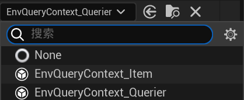

# 2025/1/20

**EQS**（Environmental Query System，环境查询系统）旨在帮助 AI 角色评估和选择环境中的目标或位置。通过设定规则，EQS 可以基于多种因素（如距离、视野、障碍物等）对多个目标进行评分，并帮助 AI 做出智能决策。

### UE EQS 的基本概念：

1. **Query（查询）**：
查询是一个定义了如何评估环境中多个目标的集合。AI 使用查询来评估多个候选目标或位置的优劣。
2. **Test（测试）**：
在查询中，测试是对目标的条件检查，例如检测目标是否可见、是否在距离范围内，或是否存在障碍物等。
3. **Item（项）**：
项是查询中需要评估的单个元素，通常是目标、位置或其他与环境相关的实体。
4. **Generator（生成器）**：
生成器负责生成查询中的项。它可以生成一个范围内的随机位置、敌人位置、玩家位置等。

### 主要功能：

- **目标选择**：根据评分选择最合适的目标（例如敌人、资源、路径点等）。
- **环境评估**：通过测试（例如距离、可见性、障碍物）对多个目标进行评分。
- **决策支持**：帮助 AI 在复杂环境中做出最优决策。

### 示例应用：

- **敌人 AI**：选择最接近的敌人或玩家的位置作为攻击目标。
- **路径选择**：选择一个可行且安全的路径，避开障碍物。
- **资源采集**：选择一个最有利的资源点进行采集。

环境查询中心点：可以是Querier本身也可以是其他Actor:



创建环境查询情境复写提供单一Actor函数：


这里的Querier Actor就是查询者，即AI Controller，通过在里定义Actor变量即可传递过来。就可以实现在任意Actor上实现EQS系统。

# Work01：怪物寻找掩体

现在受击后，如果攻击者距离怪物过远，怪物会优先寻找掩体以阻止伤害。这里巡逻范围也可以提升为变量。


其中SetMovementSpeed是根据速度类型来选择的接口函数（如之前提过）：

```cpp
float AMyEnemyCharacter::SetMovementSpeed_Implementation(EMovementSpeed MovementSpeed)
{
	UCharacterMovementComponent* CharacterMovementComponent= GetCharacterMovement();
	float SpeedValue=0.0f;
	if (CharacterMovementComponent)
	{
		if (MovementSpeed==EMovementSpeed::Idle)
		{
			CharacterMovementComponent->MaxWalkSpeed=0;
			SetSpeed(0.0f);
			SpeedValue=0.0f;
		}
		if (MovementSpeed==EMovementSpeed::Walking)
		{
			CharacterMovementComponent->MaxWalkSpeed=300.0f;
			SetSpeed(150.0f);
			SpeedValue=300.0f;
		}
		if (MovementSpeed==EMovementSpeed::Jogging)
		{
			CharacterMovementComponent->MaxWalkSpeed=400.0f;
			SetSpeed(400.0f);
			SpeedValue=500.0f;
		}
		if (MovementSpeed==EMovementSpeed::Sprinting)
		{
			CharacterMovementComponent->MaxWalkSpeed=800.0f;
			SetSpeed(800.0f);
			SpeedValue=800.0f;
		}
	}
	return SpeedValue;
}
```

这里选择Sprinting，让怪物以最大行动速度找掩体去。危机解除后又回到Passive巡逻状态

EQS系统如下：

情景查询里需要传递攻击目标：


EQS里生成可躲避点，这里使用网格方式，接下来设置了三个测试：


1. 丢弃怪物无法到达的地点；
2. 检测攻击者是否能看到自己；这里需要把项目境高度偏移拉高一些（差不多到脖子的位置），否则会出现与遮挡物不正确的检测（如斜坡）。


1. 选择离自己最近的可躲避点。这里需要反转得分才能筛选出离自己近的躲藏点。


以PlayerStart作为AttackTarget测试，图中绿色即为可躲藏的点：


现在怪物就”学会躲避“了，一旦玩家为了杀死怪物进入怪物的感知范围就会引来无穷无尽的追击。

