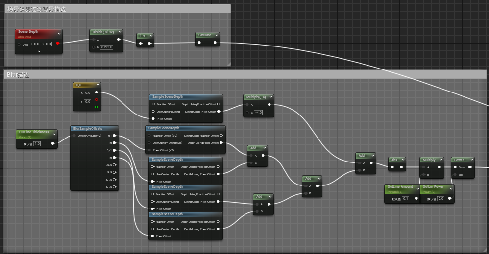
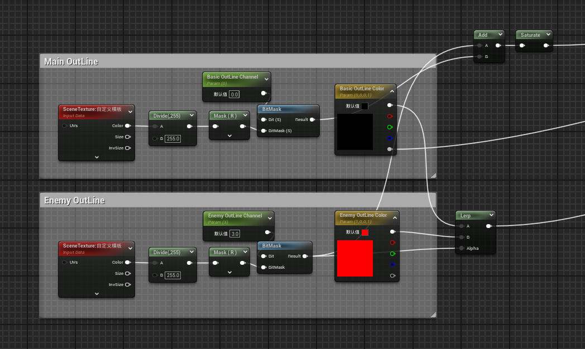
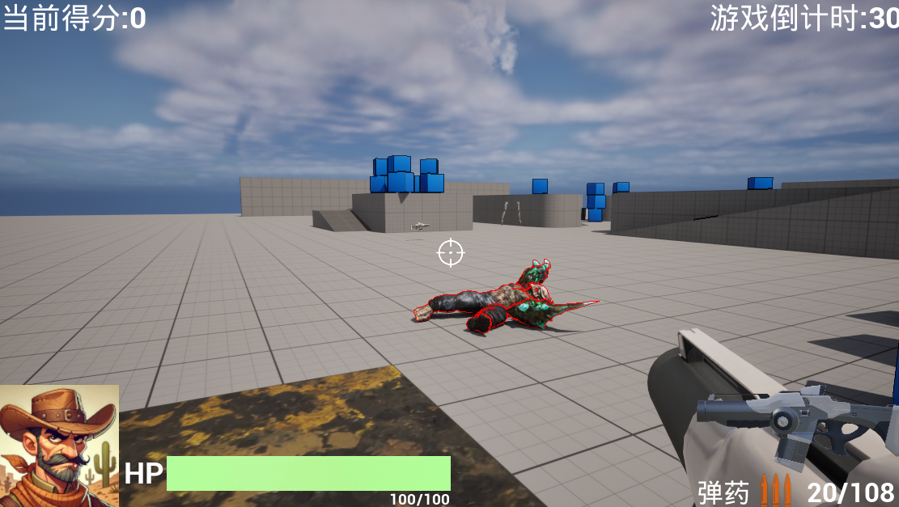

# 2025/1/2

主要解决问题：

- OutLine描边效果

# Work02：基于深度模板的描边

使用简单的基于深度缓冲值差异来检测物体边缘，然后多次采样模糊计算描边效果。

采集场景深度过滤掉不需要的背景描边。

为了区分不同的物体可以有不同的描边，使用Stencil模板过滤：场景纹理使用自定义模板，BitMask根据选定的深度通道**CustomDepthStencil**筛选是否与当前掩码匹配。结果就作为alpha值插值不同的描边颜色，这里设置两个颜色，一个是基础描边颜色一个是敌人描边。

最后计算出来的描边结果作为mask和原场景颜色lerp即可。

效果：

