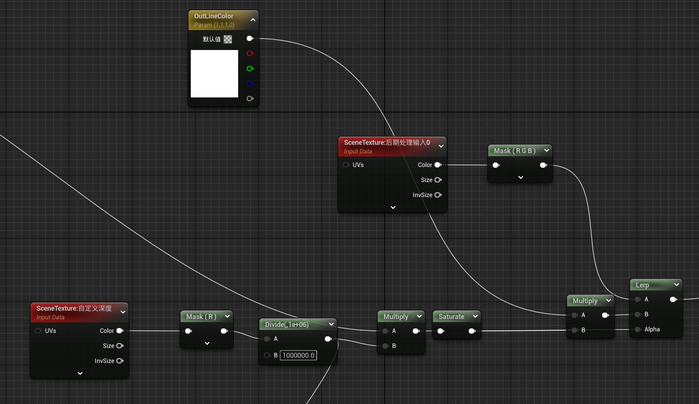
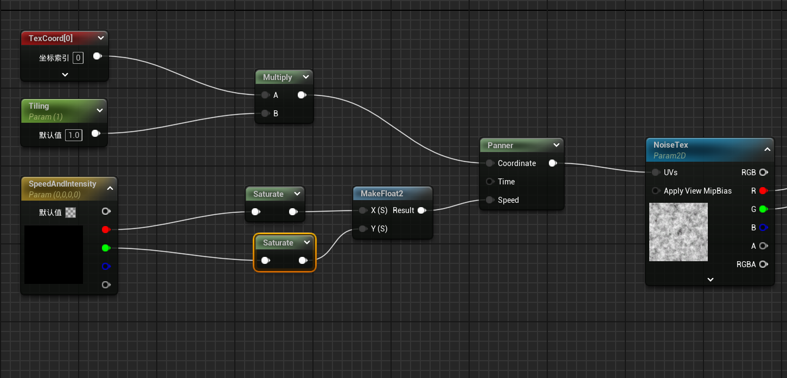
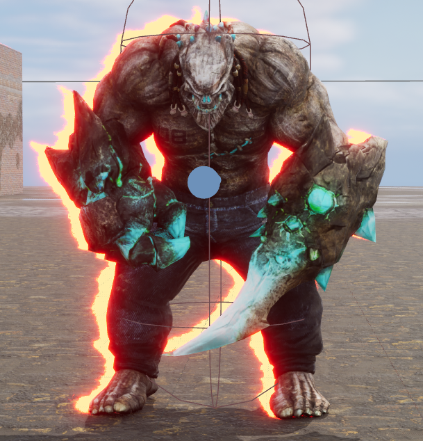
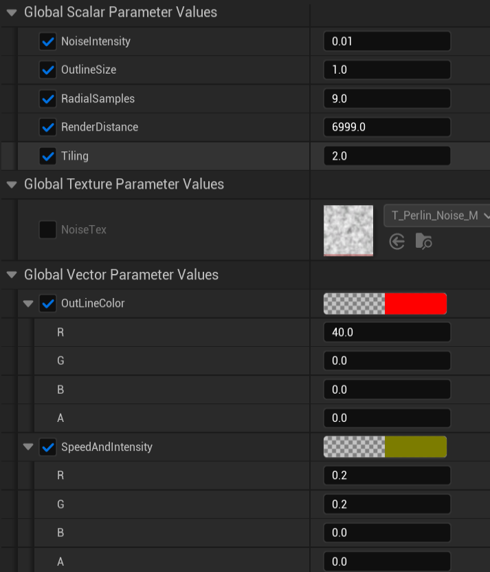

# 2025/1/18

主要解决问题：

- OutLine描边效果优化

# Work01：解决描边闪烁问题

原因是后处理效果混合位置不正确，将混合位置向前调整，放在“景深前的场景颜色”即可。

# Work02：风格化描边

`View.ViewSizeAndInvSize` 是一个 4D 向量，其分量如下：

- `View.ViewSizeAndInvSize.x`：屏幕的宽度（单位：像素）。
- `View.ViewSizeAndInvSize.y`：屏幕的高度（单位：像素）。
- `View.ViewSizeAndInvSize.z`：屏幕宽度的倒数（1 / 宽度）。
- `View.ViewSizeAndInvSize.w`：屏幕高度的倒数（1 / 高度）。

使用倒数缩放纹理坐标。

Csutom节点中：

```glsl
#define PI 3.1415926
float CombinedSamples=0;//采样贴图累加
int OffsetDirection=1;//偏移方向
float RadialIncrement;//随机性变量
float2 RadialOffset;//偏移值

float DitheredSampleOffset=1.0;
float2 ScaleSampleOffset;
ScaleSampleOffset=(DitheredSampleOffset,DitheredSampleOffset)*View.ViewSizeAndInvSize.zw*(OutlineSize)*View.ViewSizeAndInvSize.x/1920;//除以1920自适应屏幕
for(int i=1;i<=RadialSamples;i++) {
    //生成径向偏移
    RadialIncrement=i/RadialSamples;
    RadialOffset.x=cos(RadialIncrement*2*PI);
    RadialOffset.y=sin(RadialIncrement*2*PI);
    CombinedSamples+=saturate(1-(floor(SceneTextureLookup(ClampSceneTextureUV(ViewportUVToSceneTextureUV(GetViewportUV(Parameters)+Noise+ScaleSampleOffset*RadialOffset*OffsetDirection,13),13),13,false).r/RenderDistance)));
    //更改采样方向
    OffsetDirection*=-1;
}
CombinedSamples/=RadialSamples;
return CombinedSamples;

```

OutlineSize控制描边大小，RadialSamples控制采样数，RenderDistance做了一个距离剔除，Noise就是采样噪声图对uv做偏移。

和屏幕颜色混合：



再对噪声图添加Tiling和随时间uv偏移：



添加NoiseIntensity参数控制噪声偏移强度。

使用简单的柏林噪声贴图得到的效果如下：





