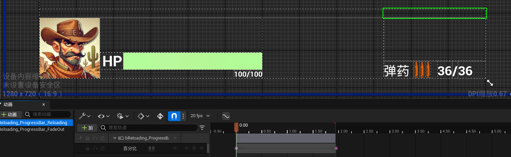
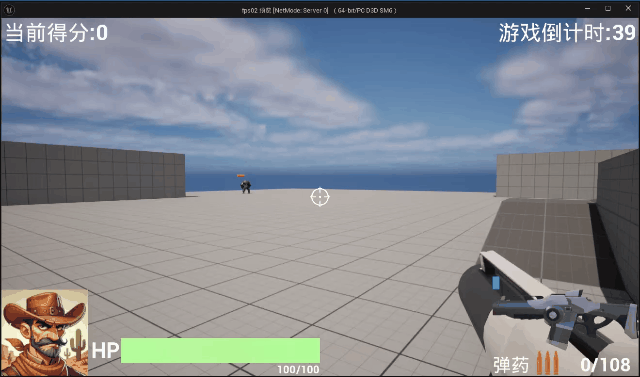

# 2024/12/31

主要解决问题：

- 场景弹药掉落物与弹药补充
- 换弹操作逻辑部分
- 换弹操作UI动画部分

# Work01：弹药包拾取

新的子弹（弹药）类设计：

```cpp
// Fill out your copyright notice in the Description page of Project Settings.

#pragma once

#include "CoreMinimal.h"
#include "Components/BoxComponent.h"
#include "MyWeaponActor.h"
#include "Net/UnrealNetwork.h"
#include "fps02/fps02Character.h"

#include "fps02/fps02PlayerController.h"
#include "GameFramework/Actor.h"
#include "MyBulletActor.generated.h"

UCLASS()
class FPS02_API AMyBulletActor : public AActor
{
	GENERATED_BODY()
	
public:	
	// Sets default values for this actor's properties
	AMyBulletActor();

protected:
	// Called when the game starts or when spawned
	virtual void BeginPlay() override;

public:	
	// Called every frame
	UPROPERTY(Replicated,EditAnywhere,BlueprintReadWrite,Category="Bullet Attributes")
	int32 MagazineNum;
	virtual void Tick(float DeltaTime) override;
	UFUNCTION()
	void OnBulletBeginOverlap(UPrimitiveComponent* OverlappedComponent, AActor* OtherActor, 
						UPrimitiveComponent* OtherComp, int32 OtherBodyIndex, 
						bool bFromSweep, const FHitResult& SweepResult);
	
	
};
//cpp
// Fill out your copyright notice in the Description page of Project Settings.

#include "MyBulletActor.h"

#include "MyPlayerState.h"

// Sets default values
AMyBulletActor::AMyBulletActor()
{
	// Set this actor to call Tick() every frame.  You can turn this off to improve performance if you don't need it.
	PrimaryActorTick.bCanEverTick = true;
}

// Called when the game starts or when spawned
void AMyBulletActor::BeginPlay()
{
	Super::BeginPlay();
	MagazineNum = FMath::RandRange(0, 5);
	TObjectPtr<UBoxComponent> CollisionBox = FindComponentByClass<UBoxComponent>();
	if (CollisionBox)
	{
		CollisionBox->SetCollisionEnabled(ECollisionEnabled::QueryAndPhysics);
		CollisionBox->SetCollisionObjectType(ECollisionChannel::ECC_WorldDynamic);
		CollisionBox->SetCollisionResponseToAllChannels(ECR_Ignore);
		CollisionBox->SetCollisionResponseToChannel(ECC_Pawn, ECR_Overlap);
		CollisionBox->OnComponentBeginOverlap.AddDynamic(this, &AMyBulletActor::OnBulletBeginOverlap);
	}
	else
	{
		UE_LOG(LogTemp, Warning, TEXT("CollisionBox not found on %s"), *GetName());
	}
}

// Called every frame
void AMyBulletActor::Tick(float DeltaTime)
{
	Super::Tick(DeltaTime);
}

void AMyBulletActor::OnBulletBeginOverlap(UPrimitiveComponent* OverlappedComponent, AActor* OtherActor,
                                          UPrimitiveComponent* OtherComp, int32 OtherBodyIndex, bool bFromSweep,
                                          const FHitResult& SweepResult)
{
	if (TObjectPtr<Afps02Character> Character = Cast<Afps02Character>(OtherActor))
	{
		if (TObjectPtr<AMyWeaponActor> WeaponActor = Cast<AMyWeaponActor>(Character->GetBMyWeapon()))
		{
			if (WeaponActor->GetBWeaponCurrentBulletNum() < WeaponActor->GetBWeaponMagazine())
			{
				WeaponActor->ReloadMagazine(MagazineNum);
				if (TObjectPtr<Afps02PlayerController> PlayerController = Cast<Afps02PlayerController>(
					Character->GetController()))
				{
					PlayerController->ServerUpdateGunMagazine(WeaponActor->GetBWeaponMagazine(),
					                                          WeaponActor->GetBMagazineNum());
				}
			}
		}
	}
	Destroy();
}

void AMyBulletActor::GetLifetimeReplicatedProps(TArray<FLifetimeProperty>& OutLifetimeProps) const
{
	Super::GetLifetimeReplicatedProps(OutLifetimeProps);
	DOREPLIFETIME(AMyBulletActor, MagazineNum);
}

```

这里注意点1是碰撞过滤仅仅让该Actor和Pawn类型Actor发生碰撞，忽略诸如子弹等的碰撞；注意点2补充弹药时仅仅当玩家弹夹不满时才允许换弹，同时需要更新HUD UI上的弹药信息，这里直接使用前面定义好的更新函数即可。

# Work02：换弹逻辑

在武器组件中添加如下函数：

```cpp
	void StartReload();
	void Reloading();
	void StopReload();
	void EquipNextMagzineIfPossible();
```

分别表示开始换弹，换弹中，结束换弹和尝试装配下一个可用弹夹。

具体逻辑如下：这里设置了两个标志位用来记录是否在换弹中和是否换弹完成。

```cpp
void UTP_WeaponComponent::StartReload()
{
	if (!BisReloading)
	{
		GetWorld()->GetTimerManager().SetTimer(ReloadTimerHandle, this,
		                                       &UTP_WeaponComponent::EquipNextMagzineIfPossible,
		                                       2.0f, false);
		BisReloading = true;
	}
}

void UTP_WeaponComponent::Reloading()
{
//执行播放动画等操作
}

void UTP_WeaponComponent::StopReload()
{
	if (BisReloadingCompleted)
	{
		//UE_LOG(LogTemp, Warning, TEXT("换弹完成"));
		BisReloadingCompleted = false;
		BisReloading = false;
	}
	else if (BisReloading)
	{
		GetWorld()->GetTimerManager().ClearTimer(ReloadTimerHandle);
		BisReloading = false;
		//UE_LOG(LogTemp, Warning, TEXT("换弹取消"));
	}
}

void UTP_WeaponComponent::EquipNextMagzineIfPossible()
{
	if (TObjectPtr<AMyWeaponActor> WeaponActor = Cast<AMyWeaponActor>(GetOwner()))
	{
		if (WeaponActor->GetBMagazineNum() > 0 && WeaponActor->GetBWeaponCurrentBulletNum() == 0)
		{
			//数值上更新子弹数量和弹夹量
			WeaponActor->SetMagazineNum(WeaponActor->GetBMagazineNum() - 1);
			WeaponActor->SetBWeaponCurrentBulletNum(WeaponActor->GetBWeaponMagazine());
			//UE_LOG(LogTemp, Warning, TEXT("弹夹余量%d,当前子弹量%d"), WeaponActor->GetBMagazineNum(),WeaponActor->GetBWeaponCurrentBulletNum());
			if (TObjectPtr<Afps02PlayerController> PlayerController = Cast<Afps02PlayerController>(
				Character->GetController()))
			{
				//UI上更新当前子弹数量和最大子弹数量
				PlayerController->ClientUpdateGunMagazine(WeaponActor->GetBWeaponMagazine(),
				                                          WeaponActor->GetBMagazineNum());
			}
		}
		BisReloadingCompleted = true;
	}
}
```


最后完善一下游戏逻辑，每隔15s场景自动生成可拾取的弹药补充道具。

```cpp
void AMyGameState::StartSpawnBullet()
{
	GetWorld()->GetTimerManager().SetTimer(BulletSpawnTimer, this, &AMyGameState::SpawnBullet, 15.0f, true);
}

void AMyGameState::SpawnBullet()
{
	if (!BulletActorClass)
	{
		UE_LOG(LogTemp, Warning, TEXT("BulletActorClass is not set!"));
		return;
	}
	FActorSpawnParameters SpawnParams;
	FVector SpawnLocation = GetRandomSpawnLocation();
	SpawnParams.SpawnCollisionHandlingOverride = ESpawnActorCollisionHandlingMethod::AdjustIfPossibleButAlwaysSpawn;
	UE_LOG(LogTemp, Log, TEXT("Spawning bullet at location: %s"), *SpawnLocation.ToString());

	GetWorld()->SpawnActor<AMyBulletActor>(BulletActorClass, SpawnLocation, FRotator::ZeroRotator,
	                                       SpawnParams);
}
```

# Work03：换弹操作UI进度条

我们设计的换弹时间是2s，在HUD widget添加一个平时用不着就折叠的进度条组件，换弹有两个动画，进度条加载和进度条淡出：



为了有足够的时间播放和逻辑转移：填单时间为1.95s，淡出动画0.25s。这里要注意每次播放前需要重新初始化参数：进度回到0.0f，渲染不透明度回到1.0f，这两个操作一定要在折叠组件之前否则无效。

```cpp
void UMyHUDWidget::ReloadGunMagazine()
{
	if (bReloading_ProgressBar)
	{
		bReloading_ProgressBar->SetRenderOpacity(1.0f);
		bReloading_ProgressBar->SetPercent(0.0f);
		bReloading_ProgressBar->SetVisibility(ESlateVisibility::Visible);
		if (bReloading_ProgressBar_Reloading)
		{
			PlayAnimation(bReloading_ProgressBar_Reloading);
		}
	}
}

void UMyHUDWidget::ReloadFadeOut()
{
	if (bReloading_ProgressBar->IsVisible())
	{
		if (bReloading_ProgressBar_FadeOut)
		{
			PlayAnimation(bReloading_ProgressBar_FadeOut);
		}
		FTimerHandle FadeOutTimerHandle;
		GetWorld()->GetTimerManager().SetTimer(
			FadeOutTimerHandle,
			this,
			&UMyHUDWidget::HideReoloadBar,
			0.25f,
			false); 
	}
}

void UMyHUDWidget::HideReoloadBar()
{
	bReloading_ProgressBar->SetVisibility(ESlateVisibility::Collapsed);
}

```

在绑定的StartReload Action中完善动画播放逻辑：

```cpp
		if (TObjectPtr<Afps02PlayerController> PlayerController = Cast<Afps02PlayerController>(
			Character->GetController()))
		{
			if (PlayerController->MyHUDWidget)
			{
				if (TObjectPtr<AMyWeaponActor> WeaponActor = Cast<AMyWeaponActor>(GetOwner()))
				{
					if (WeaponActor->GetBMagazineNum() > 0 && WeaponActor->GetBWeaponCurrentBulletNum() == 0)
					{
						PlayerController->MyHUDWidget->ReloadGunMagazine();

						GetWorld()->GetTimerManager().SetTimer(ReloadingTimerHandle, this,
						                                       &UTP_WeaponComponent::ReloadingFadeOutAnim,
						                                       2.0f, false);
					}
				}
			}
		}
//…………
//…………
void UTP_WeaponComponent::ReloadingFadeOutAnim()
{
	if (TObjectPtr<Afps02PlayerController> PlayerController = Cast<Afps02PlayerController>(
		Character->GetController()))
	{
		if (PlayerController->MyHUDWidget)
		{
			PlayerController->MyHUDWidget->ReloadFadeOut();
		}
	}
	if (GetWorld()->GetTimerManager().IsTimerActive(ReloadingTimerHandle))
	{
		GetWorld()->GetTimerManager().ClearTimer(ReloadingTimerHandle);
	}
}
```

结束换弹StopReload时将组件重新折叠：

```cpp
if (TObjectPtr<Afps02PlayerController> PlayerController = Cast<Afps02PlayerController>(
			Character->GetController()))
		{
			if (PlayerController->MyHUDWidget)
			{
				PlayerController->MyHUDWidget->HideReoloadBar();
			}
		}
```



后面有机会可以补一下换弹动画（溜。。