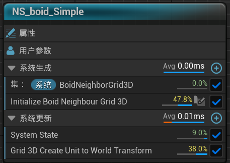

# 2025/2/5-2025/2/7

# 鱼群效果 Flcoking System

Boids算法是用来描述集群行为的规则算法：

- Separation (分离) ：指个体趋向于远离邻近其他集群体的行为；
- Alignment (对齐) ：指个体趋向于邻近其他集群体平均群游方向的行为；
- Cohesion (聚合) ：指多个个体趋向于质心的行为；

每个 boid 个体都可以得知整体的几何参数，但群体要求其只对其周围某个小邻近范围作出反应。当然这些是基础的规则，更多的规则比如避障、寻址、等都可以自定义。

Delgado-Mata ：通过情感传递展现出恐惧等情绪要素的影响；

Hartman and Benes：添加领导力（Leadership）来决定个体成为领袖的概率以及带领群体逃离的概率；

```cpp
鱼群效果 Flocking
1. 一个鱼群有一个虚拟领袖，决定航向
2. 同一鱼群，鱼和鱼之间的间距要保持在一定范围内，鱼群和鱼群之间亦然
3. 最多8群鱼，一群鱼最多32条鱼
4. 尽可能让表现自然，尽可能地优化性能，给出程序不同阶段的性能数据
5. 2D / 3D均可，不限引擎，框架，语言
6. 如果时间所限不能完成所有特性，可以在文档中写出优化思路
```

想要在UE中实现这一模拟，第一想法是利用Niagara的粒子系统去模拟行为，鉴于之前SPH水的经验，也许需要使用到Neighbour Grid 3D Interfacre,划分世界空间，填充粒子，查询邻居行为，计算速度方向等等。

首先确定一下参数：如果使用Niagara自带的Solve force and velocity模块，我们对于粒子的运动解析就需要输入Velocity和粒子当前的位置。为了读取粒子的属性，需要设置粒子属性阅读器并输入执行ID以进行属性读取。




经查阅资料，常见对于三个行为的处理方式为计算影响粒子在对应的行进方向上给自身带来的加速度变化，每次tick将加速度变化累计到速度变化上输出即可。

```glsl
	if (diffLength < InSeparationDistance)
	{
		_SeparationPositionSum += diffPosition;
		_SeparationCount++;
	}

	if (diffLength < InAlignmentDistance)
	{
		float3 targetVelocity;
		InAttributeReader.GetVectorByIndex<Attribute="Velocity">(i, _Valid, targetVelocity);
		_AlignmentVelocitySum += targetVelocity;
		_AlignmentCount++;
	}

	if (diffLength < InCohesionDistance)
	{
		_CohesionPositionSum += targetPosition;
		_CohesionCount++;
	}
```

因此在网格查询即Boids计算阶段传入如下参数，分别表示三种作用的发生范围和发生权重：


在QueryGrid中做计算：


套用NieghborGrid的计算方式，遍历当前例子相所在的27个Cell，得到他们的位置和速度

```glsl
            // Get Position
            float3 NeighborPosition = float3(0.0, 0.0, 0.0);
            inAttributeReader.GetPositionByIndex<Attribute = "Position">(NeighborIndex, bValid, NeighborPosition);
            if (!bValid)
                continue;
            bValid = false;
            // Get Velocity
            float3 NeighborVelocity = float3(0.0, 0.0, 0.0);
            inAttributeReader.GetPositionByIndex<Attribute = "Velocity">(NeighborIndex, bValid, NeighborVelocity);
            if (!bValid)
                continue;
            bValid = false;

            const float3 DeltaPosition = NeighborPosition - inPosition;
            const float3 DirectionToNeighborParticle = normalize(DeltaPosition);
            const float SqrdDistanceToNeighborParticle = dot(DeltaPosition, DeltaPosition);
```

计算三种行为，这里不使用length函数判断是否有效，算平方（能不开根号就不开嘻嘻）

```glsl
            // 考虑分离效应

            if (SqrdDistanceToNeighborParticle < (inSeparationDistance * inSeparationDistance))
            {
                const float FallOff = 1 - clamp(length(DeltaPosition) / inSeparationDistance, 0, 1);
                SeparationPositionSum += -DirectionToNeighborParticle * FallOff;
                SeperationParticles++;
            }
            // 考虑聚合效应
            if (SqrdDistanceToNeighborParticle < (inCohesionDistance * inCohesionDistance))
            {
                CohesionPositionSum+=NeighborPosition;
                CohesionParticles++;
            }
            // 考虑对齐效应
            if (SqrdDistanceToNeighborParticle < inAlignmentDistance * inAlignmentDistance)
            {
                AlignmentVelocitySum += NeighborVelocity;
                AlignmentParticles++;
            }
```

几个注意点：

- 使用了一个 falloff 函数来根据距离缩小影响力，使得越靠近的邻居对分离的影响越大。因为 Boid 行为中，粒子越接近其他粒子时会展现出更强的分离欲望（速度的突变）。
- 简单地视所有粒子相同重量，其质心近似看成几何中心。
- 对齐就是采用邻居的平均前进方向。

将累加出来的值做平均后赋给加速度：

```glsl
if (SeperationParticles > 0)
{
    float3 separationPosition = SeparationPositionSum / SeperationParticles;
    Acceleration += separationPosition * inSeparationWeight;
}
if (CohesionParticles > 0)
{
    FlockCenterOfMass = CohesionPositionSum / CohesionParticles;
    float3 cohesionAcc = (FlockCenterOfMass - inPosition) * inCohesionWeight;
    Acceleration += cohesionAcc;
}
if (AlignmentParticles > 0)
{
    float3 aligmentVelocity = AlignmentVelocitySum / AlignmentParticles;
    Acceleration += aligmentVelocity * inAlignmentWeight;
}
```

最终得到的速度就是：outVelocity = inVelocity + Acceleration;

附图：彩色方块是NieghborGrid自定义调试效果。


性能分析：取1k个粒子，行为模拟阶段迭代4次，GPU NVIDIA RTX4060ti，


大头消耗在行为模拟上，用时也还是可观的。

当只迭代1次时，只需要消耗0.16ms，但是收敛效果并不好。


左：迭代1次，右：迭代4次。迭代12次时效果与4次相当，消耗却达到了5.15ms，因此实际模拟时只需要4次就已经是一个比较不错的tradeoff选择了，更不用说粒子数量有可能更少。

问题：当粒子过少的时候，采用NeighborGrid计算邻居粒子的方式不能很好的工作（鱼群不聚合也不对齐），推测是采集到的信息过少。

换个思路，不再用一个发射器代表众多鱼群，将单个群体粒子数量下降，使用多个发射器代表多个鱼群：


鱼群对齐速度后太过一致，看起来不够灵动，对速度添加噪音，x,y,z轴扰动使其看起来更生动一些。


继续优化思路：

- 将粒子渲染器替换成网格体渲染器，添加真实的鱼类模型；
- 赋予每只鱼不同的质量，初步可以用球体积计算公式乘以密度（constant）得到，这样只需要设定半径radius这一个变量；
- 覆写加速度与速度计算模块，不再使用Niagara自带的解算工具，需要定义每一时刻鱼的行进方向，行进目的地，行进速度，转弯和掉头时可能需要计算角速度和弯曲角度来控制模型进行顶点动画处理；
- 提高生态感，对于一片水域来说，可以进行分层，浅水鱼和中层鱼以及深海鱼，可能需要定义不同的高度Altitude对粒子区域进行划分。
- 添加更多的行为规则。